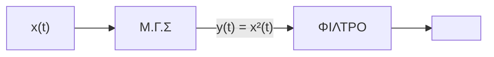

## Ιανουάριος 2026

### Θέμα 1

AM-DSB-TC με ΜΓΣΦάσμα ΣήματοςΕνέργεια Σήματος

#### Εκφώνηση

Το σήμα πληροφορίας $m(t) = 3\,\mathrm{sinc}(3Wt)$ διαμορφώνεται κατά AM-DSB-TC με τη βοήθεια της διάταξης του Σχήματος 1, όπου Μ.Γ.Σ. είναι ένα μη γραμμικό στοιχείο, του οποίου η χαρακτηριστική εξίσωση εισόδου-εξόδου δίνεται από τη σχέση $y(t) = \alpha x^2(t) + \beta x(t)$. Το φέρον δίνεται ως $c(t) = 2\cos(2\pi f_c t)$.

**α-15)** Υπολογίστε αναλυτικά και σχεδιάστε το φάσμα στην έξοδο του ΜΓΣ, $Y(f)$. Να βρεθεί το ζωνοπερατό φίλτρο (με συνάρτηση μεταφοράς $H(f)$) που πρέπει να χρησιμοποιηθεί, συναρτήσει του $W$, αν απαιτείται να μην υπάρχει —οριακά— παρεμβολή μεταξύ των όρων που δημιουργούνται στο φάσμα (όροι βασικής ζώνης και όροι γύρω από την συχνότητα φέροντος).

**β-15)** Αν το άθροισμα των ενεργειών των φασματικών όρων βασικής ζώνης είναι ίσο με το μισό της ενέργειας των υπολοίπων, να βρείτε μια σχέση για τα $\alpha$ και $\beta$. Θεωρείστε αμελητέα την ενέργεια των συναρτήσεων δέλτα (ώσεων).

#### Λύση

##### Μέρος α

**Φάσμα του $m(t)$.** Από $b\,\mathrm{sinc}(bt) \overset{\mathcal{F}}{\longleftrightarrow} \mathrm{rect}(f/b)$ (εδώ με συντελεστή 3 αντί $b=3W$):

$$M(f) = \frac{3}{3W}\,\mathrm{rect}\!\left(\frac{f}{3W}\right) = \frac{1}{W}\,\mathrm{rect}\!\left(\frac{f}{3W}\right)$$

Δηλαδή ορθογώνιο ύψους $1/W$ για $|f| \leq \tfrac{3W}{2}$ — μονόπλευρο εύρος ζώνης $W_m = \tfrac{3W}{2}$.

**Είσοδος ΜΓΣ:** $x(t) = m(t) + 2\cos(2\pi f_c t)$ (άρα $A_c = 2$).

$$y(t) = \alpha\bigl[m(t) + 2\cos(2\pi f_c t)\bigr]^2 + \beta\bigl[m(t) + 2\cos(2\pi f_c t)\bigr]$$

Αναπτύσσω το τετράγωνο:

$$y(t) = \alpha m^2(t) + 4\alpha\, m(t)\cos(2\pi f_c t) + 4\alpha\cos^2(2\pi f_c t) + \beta m(t) + 2\beta\cos(2\pi f_c t)$$

Με $\cos^2\theta = \tfrac{1}{2}(1+\cos 2\theta)$: $4\alpha\cos^2(2\pi f_c t) = 2\alpha + 2\alpha\cos(4\pi f_c t)$. Συγκεντρώνω ανά φασματική περιοχή:

$$y(t) = \underbrace{\alpha m^2(t) + \beta m(t)}_{\text{βασική ζώνη }(0\to 3W)} + \underbrace{2\alpha}_{\text{DC}} + \underbrace{2\alpha\cos(4\pi f_c t)}_{\text{στο }2f_c} + \underbrace{2\beta\!\left[1 + \frac{2\alpha}{\beta}m(t)\right]\!\cos(2\pi f_c t)}_{\text{AM-DSB-TC γύρω από }f_c}$$

**Φάσμα $Y(f)$ (αμφίπλευρο).** Κάθε όρος μετασχηματίζεται ξεχωριστά:

- $\alpha m^2(t) \to \alpha\,(M*M)(f)$: **τριγωνικό**, κορυφή $\alpha\,(M*M)(0) = \alpha\!\left(\tfrac{1}{W}\right)^2\!(3W) = \tfrac{3\alpha}{W}$ στο $f=0$, μηδενίζεται στα $\pm 3W$.
- $\beta m(t) \to \beta M(f)$: **ορθογώνιο** ύψους $\tfrac{\beta}{W}$, $|f| \leq \tfrac{3W}{2}$.
- $2\alpha \to 2\alpha\,\delta(f)$ (DC).
- $4\alpha\, m(t)\cos(2\pi f_c t) \to 2\alpha\bigl[M(f-f_c)+M(f+f_c)\bigr]$: **πλευρικές DSB-SC** ύψους $\tfrac{2\alpha}{W}$, εύρους $3W$ γύρω από $\pm f_c$.
- $2\beta\cos(2\pi f_c t) \to \beta\bigl[\delta(f-f_c)+\delta(f+f_c)\bigr]$ (**φέρον**).
- $2\alpha\cos(4\pi f_c t) \to \alpha\bigl[\delta(f-2f_c)+\delta(f+2f_c)\bigr]$ (στο $2f_c$).

| $f$ ($>0$) | Τύπος | Πλάτος/ύψος |
|-----------|-------|-------------|
| $0$ | ώση (DC) | $2\alpha$ |
| $0 \to \tfrac{3W}{2}$ | τρίγωνο ($m^2$) + ορθογώνιο ($m$) | $\tfrac{3\alpha}{W}$ στο $0$, $+\tfrac{\beta}{W}$ |
| $\tfrac{3W}{2} \to 3W$ | μόνο τρίγωνο ($m^2$) | γραμμικά → $0$ στο $3W$ |
| $f_c - \tfrac{3W}{2} \to f_c + \tfrac{3W}{2}$ | ορθογώνιο (πλευρικές) | $\tfrac{2\alpha}{W}$ |
| $f_c$ | ώση (φέρον) | $\beta$ |
| $2f_c$ | ώση | $\alpha$ |


var W = 1, fc = 6, al = 1, be = 1;

// βασική ζώνη — δύο επικαλυπτόμενοι όροι (αμφίπλευρα):
// τρίγωνο (αm², εύρος ±3W) και ορθογώνιο (βm, εύρος ±3W/2)
var ftri = [], ytri = [];
for (var f = -3 * W; f <= 3 * W + 1e-9; f += 0.02) {
  ftri.push(f); ytri.push(al * (3 / W) * (1 - Math.abs(f) / (3 * W)));
}
var frec = [-1.5 * W, -1.5 * W, 1.5 * W, 1.5 * W];
var yrec = [0, be / W, be / W, 0];

// πλευρικές DSB-SC γύρω από ±fc: ορθογώνια ύψους 2α/W
function band(c) { return {x: [c-1.5*W, c-1.5*W, c+1.5*W, c+1.5*W], y: [0, 2*al/W, 2*al/W, 0]}; }
var bp = band(fc), bn = band(-fc);

var dark = window.matchMedia('(prefers-color-scheme: dark)').matches;
var fontColor = dark ? '#e8e8ed' : '#1c1c1e';
var zeroColor = dark ? 'rgba(255,255,255,0.2)' : 'rgba(0,0,0,0.2)';

var data = [
  {x: ftri, y: ytri, type: 'scatter', mode: 'lines', name: 'αm² (τρίγωνο)',
   line: {color: '#22c55e', width: 2}, fill: 'tozeroy',
   fillcolor: 'rgba(34,197,94,0.14)', hoverinfo: 'skip'},
  {x: frec, y: yrec, type: 'scatter', mode: 'lines', name: 'βm (ορθογώνιο)',
   line: {color: '#a855f7', width: 2}, fill: 'tozeroy',
   fillcolor: 'rgba(168,85,247,0.14)', hoverinfo: 'skip'},
  {x: bp.x, y: bp.y, type: 'scatter', mode: 'lines', name: 'πλευρικές (γύρω από ±f_c)',
   line: {color: '#3b82f6', width: 2}, fill: 'tozeroy',
   fillcolor: 'rgba(59,130,246,0.12)', hoverinfo: 'skip'},
  {x: bn.x, y: bn.y, type: 'scatter', mode: 'lines', showlegend: false,
   line: {color: '#3b82f6', width: 2}, fill: 'tozeroy',
   fillcolor: 'rgba(59,130,246,0.12)', hoverinfo: 'skip'},
];

// ώσεις (δέλτα): DC στο 0 (2α), φέρον στα ±fc (β), και στα ±2fc (α)
var deltas = [[0, 2*al, '2α'], [fc, be, 'β'], [-fc, be, 'β'], [2*fc, al, 'α'], [-2*fc, al, 'α']];
deltas.forEach(function(d, i) {
  data.push({x: [d[0], d[0]], y: [0, d[1]], type: 'scatter', mode: 'lines+markers+text',
    line: {color: '#f97316', width: 2},
    marker: {symbol: 'triangle-up', size: 9, color: '#f97316'},
    text: ['', d[2]], textposition: 'top center', textfont: {size: 11, color: '#f97316'},
    name: 'ώσεις (φέρον/DC/2f_c)', showlegend: i === 0, hoverinfo: 'skip'});
});

var layout = {
  xaxis: {title: {text: 'f', font: {color: fontColor}},
          tickvals: [-2*fc, -fc, 0, fc, 2*fc],
          ticktext: ['−2f_c', '−f_c', '0', 'f_c', '2f_c'],
          zeroline: true, zerolinecolor: zeroColor, showgrid: false,
          color: fontColor, range: [-2*fc - 1, 2*fc + 1]},
  yaxis: {showticklabels: true, showgrid: true, gridcolor: zeroColor,
          tickvals: [1, 2, 3], ticktext: ['β/W', '2α/W', '3α/W'],
          zeroline: true, zerolinecolor: zeroColor, range: [0, 3.6],
          color: fontColor, automargin: true},
  showlegend: true,
  legend: {orientation: 'h', y: -0.18, font: {size: 10, color: fontColor}},
  margin: {t: 20, b: 60, l: 55, r: 10},
  height: 260,
  paper_bgcolor: 'rgba(0,0,0,0)',
  plot_bgcolor:  'rgba(0,0,0,0)',
  font: {color: fontColor},
};

Plotly.newPlot(gd, data, layout, {responsive: true, displayModeBar: false});


**Ζωνοπερατό φίλτρο.** Ο BPF επιλέγει μόνο τον όρο γύρω από $f_c$, ο οποίος εκτείνεται από $f_c - \tfrac{3W}{2}$ έως $f_c + \tfrac{3W}{2}$ (εύρος $3W$):

$$\boxed{H(f) = \mathrm{rect}\!\left(\frac{f - f_c}{3W}\right) + \mathrm{rect}\!\left(\frac{f + f_c}{3W}\right)}$$

με μοναδιαίο κέρδος και κεντρική συχνότητα $f_c$.

**Συνθήκη μη-παρεμβολής.** Η βασική ζώνη (λόγω του $\alpha m^2$) φτάνει έως $3W$. Για να μην παρεμβάλλεται —οριακά— με τη χαμηλότερη συχνότητα του όρου γύρω από το φέρον ($f_c - \tfrac{3W}{2}$):

$$f_c - \frac{3W}{2} \geq 3W \implies \boxed{f_c \geq \frac{9W}{2}}$$

(οριακά $f_{c,\min} = \tfrac{9W}{2}$).

##### Μέρος β

**Ταυτοποίηση όρων.** Αμελώντας τις ώσεις (DC, φέρον, $2f_c$), οι **συνεχείς** φασματικοί όροι είναι:

- **Βασική ζώνη:** $s_{bb}(t) = \alpha m^2(t) + \beta m(t)$
- **Υπόλοιποι** (γύρω από $f_c$): $s_{c}(t) = 4\alpha\, m(t)\cos(2\pi f_c t)$

**Ολοκληρώματα δυνάμεων sinc.** Με $\int\mathrm{sinc}^2 = 1$, $\int\mathrm{sinc}^3 = \tfrac{3}{4}$, $\int\mathrm{sinc}^4 = \tfrac{2}{3}$ και την κλιμάκωση $\int g(bt)\,dt = \tfrac{1}{b}\int g(u)\,du$ (εδώ $b = 3W$):

$$\int m^2\,dt = 9\!\int\!\mathrm{sinc}^2(3Wt)\,dt = \frac{9}{3W} = \frac{3}{W}$$

$$\int m^3\,dt = 27\!\int\!\mathrm{sinc}^3(3Wt)\,dt = \frac{27}{3W}\cdot\frac{3}{4} = \frac{27}{4W}$$

$$\int m^4\,dt = 81\!\int\!\mathrm{sinc}^4(3Wt)\,dt = \frac{81}{3W}\cdot\frac{2}{3} = \frac{18}{W}$$

**Ενέργεια βασικής ζώνης** (ενέργεια του συνολικού σήματος — περιλαμβάνει τον σταυρωτό όρο):

$$E_{bb} = \int\!\bigl(\alpha m^2 + \beta m\bigr)^2 dt = \alpha^2\!\int m^4 + 2\alpha\beta\!\int m^3 + \beta^2\!\int m^2$$

$$E_{bb} = \frac{1}{W}\!\left(18\alpha^2 + \frac{27}{2}\alpha\beta + 3\beta^2\right)$$

**Ενέργεια υπολοίπων** ($f_c$ μεγάλο → μέση τιμή $\cos^2 = \tfrac{1}{2}$):

$$E_{c} = \int 16\alpha^2 m^2(t)\cos^2(2\pi f_c t)\,dt = 16\alpha^2\cdot\frac{1}{2}\!\int m^2\,dt = 8\alpha^2\cdot\frac{3}{W} = \frac{24\alpha^2}{W}$$

**Συνθήκη** $E_{bb} = \tfrac{1}{2}E_{c}$:

$$\frac{1}{W}\!\left(18\alpha^2 + \frac{27}{2}\alpha\beta + 3\beta^2\right) = \frac{1}{2}\cdot\frac{24\alpha^2}{W} = \frac{12\alpha^2}{W}$$

$$18\alpha^2 + \frac{27}{2}\alpha\beta + 3\beta^2 = 12\alpha^2 \implies 6\alpha^2 + \frac{27}{2}\alpha\beta + 3\beta^2 = 0$$

Πολλαπλασιάζω επί $2$ και διαιρώ διά $3$:

$$\boxed{4\alpha^2 + 9\alpha\beta + 2\beta^2 = 0}$$

Παραγοντοποιώντας: $(4\alpha + \beta)(\alpha + 2\beta) = 0$, δηλαδή

$$\beta = -4\alpha \quad \text{ή} \quad \beta = -\frac{\alpha}{2}$$

(Και οι δύο δίνουν $E_{bb} = \tfrac{12\alpha^2}{W} > 0$ — ο σταυρωτός όρος $\propto\int m^3$ τις καθιστά συμβατές.)

---

### Θέμα 2

FM ΔιαμόρφωσηΥπερετερόδυνος ΔέκτηςΑρμονικές Bessel

#### Εκφώνηση

Σύστημα επικοινωνίας αέρος–εδάφους βασίζεται σε διαμόρφωση FM. Το σήμα πληροφορίας από το εναέριο μέσο, $m(t)$, είναι ο τόνος που φαίνεται στο Σχήμα 2. Το σήμα αυτό διαμορφώνεται κατά FM με συχνότητα φέροντος $f_c = 90\,\mathrm{MHz}$, πλάτος φέροντος $A_c = 2\,\mathrm{V}$ και απόκλιση συχνότητας διαμορφωτή $5\,\mathrm{kHz}$. Στο έδαφος χρησιμοποιείται υπερετερόδυνος δέκτης που διαθέτει φίλτρο RF με ζώνη διέλευσης $85$–$95\,\mathrm{MHz}$ και φίλτρο IF με κεντρική συχνότητα $f_{IF} = 0.5\,\mathrm{MHz}$.

Από το Σχήμα 2, ο τόνος $m(t)$ έχει πλάτος $0.4\,\mathrm{V}$ και περίοδο $1\,\mathrm{ms}$, δηλαδή $m(t) = 0.4\cos(2\pi\cdot 1000\,t)$.


var dark = window.matchMedia('(prefers-color-scheme: dark)').matches;
var fontColor = dark ? '#e8e8ed' : '#1c1c1e';
var zeroColor = dark ? 'rgba(255,255,255,0.2)' : 'rgba(0,0,0,0.2)';
var gridColor = dark ? 'rgba(255,255,255,0.08)' : 'rgba(0,0,0,0.08)';

// m(t) = 0.4 cos(2π·1000·t), t σε ms → δύο περίοδοι στα 0–2 ms
var t = [], y = [];
for (var i = 0; i <= 400; i++) {
  var tm = 2 * i / 400;              // ms
  t.push(tm);
  y.push(0.4 * Math.cos(2 * Math.PI * tm));   // περίοδος 1 ms
}

var data = [{
  x: t, y: y, type: 'scatter', mode: 'lines',
  line: {color: '#3b82f6', width: 2.5},
  showlegend: false, hoverinfo: 'skip'
}];

var layout = {
  xaxis: {title: {text: 'time (msec)', font: {color: fontColor}},
          range: [0, 2], dtick: 0.2, showgrid: true, gridcolor: gridColor,
          zeroline: false, color: fontColor},
  yaxis: {title: {text: 'Volt', font: {color: fontColor}},
          range: [-0.45, 0.45], dtick: 0.1, showgrid: true, gridcolor: gridColor,
          zeroline: true, zerolinecolor: zeroColor, color: fontColor},
  margin: {t: 15, b: 45, l: 50, r: 15},
  height: 250,
  paper_bgcolor: 'rgba(0,0,0,0)',
  plot_bgcolor:  'rgba(0,0,0,0)',
  font: {color: fontColor},
};

Plotly.newPlot(gd, data, layout, {responsive: true, displayModeBar: false});


Σχήμα 2: Σήμα πληροφορίας $m(t)$.

**α-10)** Να βρεθούν η συχνότητα $f_m$ του σήματος $m(t)$, η ευαισθησία συχνότητας $K_f$, ο δείκτης διαμόρφωσης $\beta_f$, καθώς και οι εικονικές συχνότητες σε περίπτωση που χρησιμοποιείται i) έγχυση υψηλής ζώνης (HSI) και ii) έγχυση χαμηλής ζώνης (LSI).

**β-10)** Να υπολογιστεί η ισχύς της αρμονικής στην συχνότητα φέροντος του διαμορφωμένου σήματος σε dBm.

**γ-5)** Λόγω παρεμβολών υπάρχουν ανεπιθύμητες εκπομπές (παρεμβολές) στην εικονική συχνότητα LSI και στην εικονική συχνότητα HSI. Ποιος από τους δύο παρεμβολείς θα μπορούσε να δημιουργήσει πρόβλημα;

**δ-10)** Αν επιλεγεί ένα στενότερο φίλτρο RF με ζώνη διέλευσης $87.5$–$90.5\,\mathrm{MHz}$ και LSI, θα υπάρχει παρεμβολή; Εάν ναι, θεωρήστε ότι το σήμα παρεμβολής είναι ημιτονοειδές με μοναδιαίο πλάτος και συχνότητα $f_{m_2} = 0.5\,\mathrm{MHz}$ και διαμορφώνεται κατά FM με συχνότητα φέροντος $f_{c_2}$ που ισούται με την εικονική συχνότητα, πλάτος φέροντος $A_{c_2} = 0.5\,\mathrm{V}$ και ευαισθησία συχνότητας $K_{f_2} = 1.5\,\mathrm{MHz/V}$. Να εξετάσετε εάν το σήμα αυτό προκαλεί ισχυρή παρεμβολή στην συχνότητα $90\,\mathrm{MHz}$, δηλαδή εάν ο λόγος των ισχύων επιθυμητού σήματος προς παρεμβολής είναι **μικρότερος** από $5\,\mathrm{dB}$.

#### Λύση

##### Μέρος α

**Συχνότητα $f_m$.** Από το Σχήμα 2, μία πλήρης περίοδος του τόνου ολοκληρώνεται σε $T = 1\,\mathrm{ms}$:

$$f_m = \frac{1}{T} = \frac{1}{10^{-3}} = \boxed{1\,\mathrm{kHz}}$$

**Ευαισθησία $K_f$.** Η απόκλιση συχνότητας είναι $\Delta f = K_f\cdot\max|m(t)| = K_f\cdot A_m$, με $A_m = 0.4\,\mathrm{V}$ και $\Delta f = 5\,\mathrm{kHz}$:

$$K_f = \frac{\Delta f}{A_m} = \frac{5000}{0.4} = \boxed{12.5\,\mathrm{kHz/V}}$$

**Δείκτης διαμόρφωσης $\beta_f$.**

$$\beta_f = \frac{\Delta f}{f_m} = \frac{k_f A_m}{f_m} = \frac{5\,\mathrm{kHz}}{1\,\mathrm{kHz}} = \boxed{5}$$

**Εικονικές συχνότητες.** Με $f_{IF} = 0.5\,\mathrm{MHz}$ ο τοπικός ταλαντωτής και η εικονική συχνότητα είναι:

- **HSI** (έγχυση υψηλής ζώνης): $f_{LO} = f_c + f_{IF} = 90.5\,\mathrm{MHz}$, εικονική $f_{im}^{HSI} = f_c + 2f_{IF} = \boxed{91\,\mathrm{MHz}}$
- **LSI** (έγχυση χαμηλής ζώνης): $f_{LO} = f_c - f_{IF} = 89.5\,\mathrm{MHz}$, εικονική $f_{im}^{LSI} = f_c - 2f_{IF} = \boxed{89\,\mathrm{MHz}}$

(Η εικονική συχνότητα απέχει $2f_{IF}$ από το επιθυμητό φέρον· και οι δύο δίνουν στην IF το ίδιο $0.5\,\mathrm{MHz}$ μετά τη μίξη με τον $f_{LO}$.)


var dark = window.matchMedia('(prefers-color-scheme: dark)').matches;
var fontColor = dark ? '#e8e8ed' : '#1c1c1e';
var zeroColor = dark ? 'rgba(255,255,255,0.2)' : 'rgba(0,0,0,0.2)';

function stem(x, h, color, name, show, row) {
  return {x: [x, x], y: [0, h], xaxis: row === 2 ? 'x2' : 'x', yaxis: row === 2 ? 'y2' : 'y',
    type: 'scatter', mode: 'lines+markers+text', line: {color: color, width: 2.5},
    marker: {symbol: 'circle', size: 7, color: color},
    text: ['', name], textposition: 'top center', textfont: {size: 10, color: color},
    name: name, showlegend: false, hoverinfo: 'skip'};
}

var data = [
  // HSI: επιθυμητό 90, f_LO 90.5, εικονική 91
  stem(90,   1.0, '#3b82f6', 'f_c = 90', false, 1),
  stem(90.5, 0.75, '#f97316', 'f_LO = 90.5', false, 1),
  stem(91,   1.0, '#ef4444', 'f_im = 91', false, 1),
  // LSI: εικονική 89, f_LO 89.5, επιθυμητό 90
  stem(89,   1.0, '#ef4444', 'f_im = 89', false, 2),
  stem(89.5, 0.75, '#f97316', 'f_LO = 89.5', false, 2),
  stem(90,   1.0, '#3b82f6', 'f_c = 90', false, 2),
];

var rfband = function(row) {
  return {x: [85, 85, 95, 95], y: [0, 1.25, 1.25, 0],
    xaxis: row === 2 ? 'x2' : 'x', yaxis: row === 2 ? 'y2' : 'y',
    type: 'scatter', mode: 'lines', line: {width: 0}, fill: 'toself',
    fillcolor: 'rgba(120,120,120,0.10)', showlegend: false, hoverinfo: 'skip'};
};
data.unshift(rfband(1), rfband(2));

var ax = {range: [88, 92], showgrid: false, zeroline: false, color: fontColor,
          tickvals: [88, 89, 90, 91, 92]};
var ay = {range: [0, 1.45], showticklabels: false, showgrid: false,
          zeroline: true, zerolinecolor: zeroColor};

var layout = {
  grid: {rows: 2, columns: 1, pattern: 'independent'},
  xaxis:  Object.assign({title: {text: 'HSI — f (MHz)', font: {size: 11, color: fontColor}}}, ax),
  yaxis:  Object.assign({anchor: 'x'}, ay),
  xaxis2: Object.assign({title: {text: 'LSI — f (MHz)', font: {size: 11, color: fontColor}}}, ax),
  yaxis2: Object.assign({anchor: 'x2'}, ay),
  margin: {t: 20, b: 50, l: 10, r: 10},
  height: 340,
  paper_bgcolor: 'rgba(0,0,0,0)',
  plot_bgcolor:  'rgba(0,0,0,0)',
  font: {color: fontColor},
};

Plotly.newPlot(gd, data, layout, {responsive: true, displayModeBar: false});


##### Μέρος β

Στο FM σήμα η αρμονική στη **συχνότητα φέροντος** είναι ο όρος $J_0(\beta_f)$ του αναπτύγματος Bessel, με ισχύ:

$$P_{f_c} = \frac{A_c^2}{2}\,J_0^2(\beta_f)$$

Για $\beta_f = 5$ (από πίνακα Bessel $J_0(5) = -0.178$):

$$P_{f_c} = \frac{2^2}{2}\cdot(-0.178)^2 = 2\cdot 0.0316 = 0.0631\,\mathrm{W} = 63.1\,\mathrm{mW}$$

Σε dBm:

$$P_{f_c}\,[\mathrm{dBm}] = 10\log_{10}\!\left(\frac{63.1\,\mathrm{mW}}{1\,\mathrm{mW}}\right) = 10\log_{10}(63.1) \approx \boxed{18.0\,\mathrm{dBm}}$$

##### Μέρος γ

Ρόλος του φίλτρου RF είναι να **απορρίπτει την εικονική συχνότητα** πριν τη μίξη. Όποια εικονική πέφτει **μέσα** στη ζώνη διέλευσης ($85$–$95\,\mathrm{MHz}$) δεν αποκόπτεται και μεταφέρεται στην IF μαζί με το επιθυμητό σήμα:

- $f_{im}^{LSI} = 89\,\mathrm{MHz} \in [85, 95]$ → **περνά** τον RF
- $f_{im}^{HSI} = 91\,\mathrm{MHz} \in [85, 95]$ → **περνά** τον RF

Και οι **δύο** εικονικές βρίσκονται εντός της ζώνης διέλευσης, οπότε το ευρύ φίλτρο RF δεν απορρίπτει καμία — **και οι δύο παρεμβολείς μπορούν να δημιουργήσουν πρόβλημα**. (Γι' αυτό στο επόμενο ερώτημα δοκιμάζεται στενότερο φίλτρο.)

##### Μέρος δ

**Υπάρχει παρεμβολή;** Με το στενότερο φίλτρο RF ($87.5$–$90.5\,\mathrm{MHz}$) και LSI, η εικονική συχνότητα είναι $f_{im}^{LSI} = 89\,\mathrm{MHz}$:

$$89\,\mathrm{MHz} \in [87.5,\ 90.5] \implies \textbf{ναι, η εικονική περνά → υπάρχει παρεμβολή}$$

(Σημείωση: η HSI εικονική στα $91\,\mathrm{MHz}$ θα είχε απορριφθεί από αυτό το φίλτρο — γι' αυτό εξετάζεται η LSI.)

**Χαρακτηριστικά του παρεμβάλλοντος FM σήματος.** Φέρον $f_{c_2} = f_{im}^{LSI} = 89\,\mathrm{MHz}$, $A_{c_2} = 0.5\,\mathrm{V}$, $K_{f_2} = 1.5\,\mathrm{MHz/V}$, τόνος $f_{m_2} = 0.5\,\mathrm{MHz}$ μοναδιαίου πλάτους:

$$\Delta f_2 = K_{f_2}\cdot A_{m_2} = 1.5\cdot 1 = 1.5\,\mathrm{MHz}, \qquad \beta_2 = \frac{\Delta f_2}{f_{m_2}} = \frac{1.5}{0.5} = 3$$

**Ποια συνιστώσα πέφτει στα $90\,\mathrm{MHz}$;** Το FM φάσμα του παρεμβολέα έχει αρμονικές στα $f_{c_2} + n f_{m_2} = 89 + 0.5n\,\mathrm{MHz}$. Η συνιστώσα στα $90\,\mathrm{MHz}$ αντιστοιχεί σε $n = 2$:

$$89 + 0.5\cdot 2 = 90\,\mathrm{MHz} \quad(\text{αρμονική } J_2(\beta_2))$$

**Λόγος ισχύων στα $90\,\mathrm{MHz}$.** Συγκρίνουμε τη συνιστώσα του επιθυμητού σήματος στα $90\,\mathrm{MHz}$ (το φέρον του, $J_0(\beta_f)$) με τη συνιστώσα του παρεμβολέα στα $90\,\mathrm{MHz}$ (η αρμονική $n=2$, $J_2(\beta_2)$):

$$P_S = \frac{A_c^2}{2}J_0^2(\beta_f) = \frac{2^2}{2}\,J_0^2(5) = 2\cdot(0.178)^2 = 0.0631\,\mathrm{W}$$

$$P_I = \frac{A_{c_2}^2}{2}J_2^2(\beta_2) = \frac{0.5^2}{2}\,J_2^2(3) = 0.125\cdot(0.486)^2 = 0.0295\,\mathrm{W}$$

$$\frac{P_S}{P_I} = \frac{0.0631}{0.0295} = 2.14 \implies 10\log_{10}(2.14) \approx \boxed{3.3\,\mathrm{dB}}$$

**Συμπέρασμα.** $\dfrac{P_S}{P_I} \approx 3.3\,\mathrm{dB} < 5\,\mathrm{dB}$ → ο λόγος επιθυμητού προς παρεμβολή είναι **μικρότερος** από $5\,\mathrm{dB}$, άρα **το σήμα προκαλεί ισχυρή παρεμβολή** στα $90\,\mathrm{MHz}$.


var dark = window.matchMedia('(prefers-color-scheme: dark)').matches;
var fontColor = dark ? '#e8e8ed' : '#1c1c1e';
var zeroColor = dark ? 'rgba(255,255,255,0.2)' : 'rgba(0,0,0,0.2)';

// παρεμβολέας: FM φέρον 89 MHz, β2=3, A_c2=0.5 → ύψος (A_c2/2)|J_n(3)|
var Jn3 = {0: 0.2601, 1: 0.3391, 2: 0.4861, 3: 0.3091, 4: 0.1320};
var idata = [];
for (var n = -3; n <= 3; n++) {
  var f = 89 + 0.5 * n;
  var h = 0.25 * Jn3[Math.abs(n)];
  var hot = (n === 2);
  idata.push({x: [f, f], y: [0, h], type: 'scatter', mode: 'lines+markers',
    line: {color: hot ? '#ef4444' : 'rgba(239,68,68,0.45)', width: hot ? 3 : 2},
    marker: {size: hot ? 8 : 5, color: hot ? '#ef4444' : 'rgba(239,68,68,0.45)'},
    showlegend: false, hoverinfo: 'skip'});
}

// επιθυμητό φέρον στα 90 MHz: ύψος (A_c/2)|J_0(5)| = 1*0.178
idata.push({x: [90, 90], y: [0, 0.178], type: 'scatter', mode: 'lines+markers',
  line: {color: '#3b82f6', width: 3}, marker: {size: 8, color: '#3b82f6'},
  showlegend: false, hoverinfo: 'skip'});

var layout = {
  xaxis: {range: [87.2, 90.8], showgrid: false, zeroline: false, color: fontColor,
          tickvals: [87.5, 88, 88.5, 89, 89.5, 90, 90.5],
          title: {text: 'f (MHz)', font: {color: fontColor}}},
  yaxis: {range: [0, 0.21], showticklabels: false, showgrid: false,
          zeroline: true, zerolinecolor: zeroColor},
  annotations: [
    {text: 'επιθυμητό f_c (J₀)', x: 90, y: 0.178, ax: 30, ay: -25,
     showarrow: true, arrowhead: 2, arrowcolor: '#3b82f6',
     font: {size: 10, color: '#3b82f6'}},
    {text: 'παρεμβολή n=2 (J₂)', x: 90, y: 0.122, ax: -45, ay: -45,
     showarrow: true, arrowhead: 2, arrowcolor: '#ef4444',
     font: {size: 10, color: '#ef4444'}},
    {text: 'φέρον παρεμβολέα f_{c2} = 89', x: 89, y: 0.065, ax: -10, ay: -35,
     showarrow: true, arrowhead: 2, arrowcolor: 'rgba(239,68,68,0.6)',
     font: {size: 9, color: fontColor}},
  ],
  margin: {t: 30, b: 45, l: 10, r: 10},
  height: 260,
  paper_bgcolor: 'rgba(0,0,0,0)',
  plot_bgcolor:  'rgba(0,0,0,0)',
  font: {color: fontColor},
};

Plotly.newPlot(gd, idata, layout, {responsive: true, displayModeBar: false});


Η αρμονική $n=2$ του παρεμβολέα (στα $89 + 2\cdot 0.5 = 90\,\mathrm{MHz}$) συμπίπτει με το φέρον του επιθυμητού σήματος και, επειδή ο λόγος $P_S/P_I$ είναι μόλις $3.3\,\mathrm{dB}$, υπερισχύει η παρεμβολή.

---

## Ιούλιος 2025

### Θέμα 1

AM-DSB-TC με ΜΓΣΦάσμα Σήματος

#### Εκφώνηση

Το σήμα πληροφορίας $m(t) = a\cos(2\pi f_0 t)$ διαμορφώνεται κατά AM-DSB-TC με φέρον ισχύος $P_c = -3.0103\,\mathrm{dBW}$ και συχνότητας $f_c \gg f_0$.

**α-10)** Βρείτε το εύρος τιμών του $a > 0$ για τις οποίες εξασφαλίζεται ότι δεν θα προκύψει υπερδιαμόρφωση.

**β-15)** Επιλέγεται $a = 0.5\,\mathrm{V}$. Για τη διαμόρφωση χρησιμοποιείται η διάταξη του Σχήματος 1, όπου Μ.Γ.Σ. είναι ένα μη γραμμικό στοιχείο με χαρακτηριστική $y(t) = x^2(t) + 2x(t)$. Να υπολογιστεί αναλυτικά και να σχεδιαστεί το φάσμα $Y(f)$, μόνο στις θετικές συχνότητες, στην έξοδο του Μ.Γ.Σ.

**γ-10)** Να προσδιοριστεί το φίλτρο και τα χαρακτηριστικά του, ώστε η διαμόρφωση να είναι επιτυχής.

#### Λύση

##### Μέρος α

Η ισχύς φέροντος: $P_c = 10^{-3.0103/10} = 10^{-0.30103} = 0.5\,\mathrm{W}$.

Για AM-DSB-TC: $P_c = A_c^2/2 = 0.5 \implies A_c = 1\,\mathrm{V}$.

Δείκτης διαμόρφωσης: $\mu = \max|m(t)|/A_c = a/1 = a$.

Συνθήκη μη-υπερδιαμόρφωσης: $\mu \leq 1 \implies \boxed{0 < a \leq 1\,\mathrm{V}}$.

##### Μέρος β

Με $a = 0.5\,\mathrm{V}$, $A_c = 1\,\mathrm{V}$:

$$x(t) = m(t) + A_c\cos(2\pi f_c t) = 0.5\cos(2\pi f_0 t) + \cos(2\pi f_c t)$$

$$y(t) = x^2(t) + 2x(t)$$

Αναπτύσσω το $x^2(t)$:

$$x^2 = 0.25\cos^2(2\pi f_0 t) + \cos^2(2\pi f_c t) + 2 \cdot 0.5\cos(2\pi f_0 t)\cos(2\pi f_c t)$$

Εφαρμόζω $\cos^2\theta = (1+\cos 2\theta)/2$ και $\cos\alpha\cos\beta = \frac{1}{2}[\cos(\alpha-\beta)+\cos(\alpha+\beta)]$:

$$x^2 = \frac{0.25}{2}(1+\cos 4\pi f_0 t) + \frac{1}{2}(1+\cos 4\pi f_c t) + \cos 2\pi(f_c - f_0)t + \cos 2\pi(f_c+f_0)t$$

$$2x = \cos(2\pi f_0 t) + 2\cos(2\pi f_c t)$$

Συγκεντρώνω:

$$y(t) = \underbrace{\frac{5}{8}}_{\text{DC}} + \underbrace{\cos(2\pi f_0 t)}_{\text{στο }f_0} + \underbrace{\frac{1}{8}\cos(4\pi f_0 t)}_{\text{στο }2f_0} + \underbrace{\cos 2\pi(f_c-f_0)t + \cos 2\pi(f_c+f_0)t}_{\text{DSB-SC γύρω από }f_c} + \underbrace{2\cos(2\pi f_c t)}_{\text{φέρον}} + \underbrace{\frac{1}{2}\cos(4\pi f_c t)}_{\text{στο }2f_c}$$

Φάσμα $Y(f)$ για $f > 0$ (πλάτη των ώσεων $\times \frac{1}{2}$ λόγω μονόπλευρης αναπαράστασης):

| Συχνότητα | Πλάτος ώσης |
|-----------|-------------|
| $0$ (DC) | $\frac{5}{8}$ |
| $f_0$ | $\frac{1}{2}$ |
| $2f_0$ | $\frac{1}{16}$ |
| $f_c - f_0$ | $\frac{1}{2}$ |
| $f_c$ | $1$ |
| $f_c + f_0$ | $\frac{1}{2}$ |
| $2f_c$ | $\frac{1}{4}$ |

##### Μέρος γ

Ο BPF επιλέγει τον όρο γύρω από $f_c$: τα $f_c - f_0$, $f_c$, $f_c + f_0$.

Έξοδος BPF: $z(t) = 2\cos(2\pi f_c t) + \cos 2\pi(f_c-f_0)t + \cos 2\pi(f_c+f_0)t$

$$= 2\cos(2\pi f_c t) + 2\cos(2\pi f_0 t)\cos(2\pi f_c t) = 2\bigl[1 + \cos(2\pi f_0 t)\bigr]\cos(2\pi f_c t)$$

Αυτό είναι AM-DSB-TC με $A_c' = 2$, $m(t) = \cos(2\pi f_0 t)$, $\mu = a = 0.5 < 1$. ✓

**Χαρακτηριστικά BPF:**
- Κεντρική συχνότητα: $f_c$
- Εύρος ζώνης: $2f_0$ (διέλευση: $f_c - f_0 \leq |f| \leq f_c + f_0$)

**Συνθήκη για επιτυχή αποδιαμόρφωση (μη-επικάλυψη):** Ο $2f_0$ όρος δεν πρέπει να συμπέσει με τον $f_c - f_0$ όρο: $f_c - f_0 > 2f_0 \implies f_c > 3f_0$.

---

### Θέμα 2

FM ΔιαμόρφωσηΚανόνας CarsonΑρμονικές Bessel

#### Εκφώνηση

Σήμα πληροφορίας $m(t) = a\cos(2\pi \cdot 5000\, t)$, FM ευαισθησία $k_f = 100\,\mathrm{kHz/V}$, φέρον $f_c = 1\,\mathrm{MHz}$, πλάτος $A_c$. Διαθέσιμο εύρος καναλιού: $150\,\mathrm{kHz}$.

**α-10)** Βρείτε το πλάτος $a$ ώστε το διαμορφωμένο σήμα να καταλαμβάνει το 40% του διαθέσιμου εύρους ζώνης.

**β-10)** Βρείτε τον αριθμό των αρμονικών στο ενεργό εύρος ζώνης και προσδιορίστε τη συχνότητά τους.

**γ-10)** Υπολόγισε το ποσοστό της συνολικής ισχύος που βρίσκεται στη φασματική συνιστώσα στη συχνότητα φέροντος μαζί με τις δύο φασματικές συνιστώσες εκ δεξιών αυτής. Πώς μεταβάλλεται εάν $A_c' = 2A_c$;

#### Λύση

##### Μέρος α

Ενεργό εύρος ζώνης: $B = 0.40 \times 150 = 60\,\mathrm{kHz}$.

Δείκτης διαμόρφωσης: $\beta = k_f \cdot a / f_m = \dfrac{100\,000 \cdot a}{5\,000} = 20a$

Κανόνας Carson: $B = 2f_m(\beta+1) = 2 \cdot 5000 \cdot (20a+1) = 60\,000$

$$20a + 1 = 6 \implies \boxed{a = 0.25\,\mathrm{V}}$$

##### Μέρος β

$\beta = 20 \times 0.25 = 5$

Σύμφωνα με τον κανόνα Carson, σημαντικές αρμονικές μέχρι $n = \beta + 1 = 6$ από κάθε πλευρά.

Σύνολο: φέρον + 6 ζεύγη = **13 φασματικές συνιστώσες**.

Συχνότητες: $f_c + nf_m$ για $n = 0, \pm1, \pm2, \pm3, \pm4, \pm5, \pm6$, δηλ.:

$$940, 945, 950, 955, 960, 965, 970, \underbrace{1000}_{f_c}, 1005, 1010, 1015, 1020, 1025, 1030, \ldots\,\mathrm{kHz}$$

(Ή συμμετρικά: $1000 \pm 5n$ kHz για $n = 0$ έως $6$.)

##### Μέρος γ

Η συνολική ισχύς: $P_s = A_c^2/2$ (σταθερό πλάτος FM).

Ισχύς στο φέρον ($n=0$) + δεξί $n=1$ + δεξί $n=2$:

$$P = \frac{A_c^2}{2}\bigl[J_0^2(\beta) + J_1^2(\beta) + J_2^2(\beta)\bigr]$$

Για $\beta = 5$ (από πίνακα Bessel):

| $n$ | $J_n(5)$ | $J_n^2(5)$ |
|-----|----------|------------|
| 0 | $-0.178$ | $0.032$ |
| 1 | $-0.328$ | $0.107$ |
| 2 | $0.047$ | $0.002$ |

$$\text{Ποσοστό} = J_0^2(5) + J_1^2(5) + J_2^2(5) \approx 0.032 + 0.107 + 0.002 = 14.1\%$$

Αν $A_c' = 2A_c$: ο $\beta$ δεν αλλάζει (εξαρτάται μόνο από $k_f, a, f_m$) → **το ποσοστό δεν μεταβάλλεται**.

---

### Θέμα 3

ΚβάντισηSNR ΚβάντισηςΟμοιόμορφος Κβαντιστής

#### Εκφώνηση

Σήμα $x(t)$ με ομοιόμορφη κατανομή στο $[-a, a]$. Ομοιόμορφος κβαντιστής mid-rise, $R$ bits. Διακύμανση θορύβου: $\sigma_q^2 = \Delta^2/12$.

**α-15)** Αποδείξτε ότι $(\mathrm{SNR})_q = 2^{2R}$.

**β-10)** $\Delta = 1$, μέγιστη έξοδος $y_{max} = 3.5\,\mathrm{V}$. Βρείτε $a$, τον αριθμό επιπέδων κβάντισης, και τη διακύμανση θορύβου $\sigma_q^2$.

**γ-10)** Απαιτείται $(\mathrm{SNR})_q$ τουλάχιστον $10\,\mathrm{dB}$ μεγαλύτερο από αυτό του ερωτήματος β). Πόσα επιπλέον bits χρειάζονται;

#### Λύση

##### Μέρος α

Ομοιόμορφη κατανομή στο $[-a,a]$: $f_X(x) = 1/(2a)$

$$\sigma_x^2 = \int_{-a}^{a} x^2 \cdot \frac{1}{2a}\,dx = \frac{a^2}{3}$$

Βήμα: $\Delta = \dfrac{2a}{2^R}$, άρα $\Delta^2 = \dfrac{4a^2}{4^R}$.

$$(\mathrm{SNR})_q = \frac{\sigma_x^2}{\sigma_q^2} = \frac{a^2/3}{\Delta^2/12} = \frac{12 \cdot a^2/3}{4a^2/4^R} = \frac{4a^2 \cdot 4^R}{4a^2} = \boxed{4^R = 2^{2R}}$$

##### Μέρος β

Mid-rise με $R$ bits: τα επίπεδα αναπαράστασης είναι $\pm\Delta/2, \pm3\Delta/2, \ldots$

Μέγιστο επίπεδο: $y_{max} = (2^R - 1)\Delta/2$. Για $\Delta = 1$, $y_{max} = 3.5$:

$$\frac{2^R - 1}{2} = 3.5 \implies 2^R - 1 = 7 \implies \boxed{R = 3,\; L = 2^3 = 8}$$

Εύρος κβαντιστή: $[-L\Delta/2, L\Delta/2] = [-4, 4]\,\mathrm{V}$, άρα $a = 4\,\mathrm{V}$.

$$\sigma_q^2 = \frac{\Delta^2}{12} = \frac{1}{12}$$

Επαλήθευση: $(\mathrm{SNR})_q = 2^{2\cdot3} = 64 \approx 18.06\,\mathrm{dB}$.

##### Μέρος γ

Απαιτείται $(\mathrm{SNR})'_q \geq 10^{1.0} \times 64 = 640$.

Για νέο $R'$ bits (ίδιο σήμα $\sigma_x^2 = 16/3$, νέο $\Delta' = 8/2^{R'}$):

$$2^{2R'} = 640 \implies 2R'\log_{10}2 = \log_{10}640 \implies R' = \frac{\log_{10}640}{2\log_{10}2} = \frac{2.806}{0.602} = 4.66$$

Στρογγυλοποίηση προς τα πάνω: $R' = 5$.

$$\boxed{\Delta R = R' - R = 5 - 3 = 2 \text{ επιπλέον bits}}$$

Επαλήθευση: $(\mathrm{SNR})'_q = 2^{10} = 1024 \geq 640$ ✓, αύξηση $10\log(1024/64) = 10\log 16 = 12\,\mathrm{dB} \geq 10\,\mathrm{dB}$ ✓.

---

## Σεπτέμβριος 2025

### Θέμα 1

AM-DSB-TC με ΜΓΣΦάσμα Σήματος

#### Εκφώνηση

Σήμα $m(t) = M_0 + \cos(2\pi W t)$ διαμορφώνεται κατά AM-DSB-TC με τη διάταξη Σχήματος 1, όπου ΜΓΣ: $y(t) = ax^2(t)$, φέρον $c(t) = A_c\cos(2\pi f_c t)$, $A_c > a$. Το φάσμα στη θετική πλευρά μετά τον BPF δίνεται στο Σχήμα 2, με ώσεις: πλάτους $3$ στο $f_c$ και πλάτους $1.5$ στα $f_c \pm W$. Επιπλέον, το πλάτος του DC όρου του $Y(f)$ ισούται με $6$.

**α-15)** Βρείτε $a$, $M_0$, $A_c$. Υπολογίστε και σχεδιάστε το φάσμα $Y(f)$ στη θετική πλευρά.

**β-10)** Μετά το φίλτρο προστίθεται το $c(t)$. Ποια είναι η ενίσχυση $G$ έτσι ώστε το σήμα μετά την ενίσχυση να είναι διαμορφωμένο κατά AM-DSB-TC;

**γ-10)** Να βρεθεί η ελάχιστη επιτρεπόμενη $f_c$ και ο δείκτης διαμόρφωσης $\mu$. Υπάρχει υπερδιαμόρφωση;

#### Λύση

##### Μέρος α

$x(t) = m(t) + A_c\cos(2\pi f_c t) = M_0 + \cos(2\pi W t) + A_c\cos(2\pi f_c t)$

$$y(t) = a\bigl[M_0 + \cos(2\pi Wt) + A_c\cos(2\pi f_c t)\bigr]^2$$

Αναπτύσσω και κρατώ μόνο τους όρους γύρω από $f_c$ (που θα επιλέξει ο BPF):

$$y(t)\big|_{\text{γύρω από }f_c} = 2a\bigl[M_0 + \cos(2\pi Wt)\bigr]\cdot A_c\cos(2\pi f_c t)$$

$$= 2aA_c M_0\cos(2\pi f_c t) + aA_c\bigl[\cos 2\pi(f_c - W)t + \cos 2\pi(f_c+W)t\bigr]$$

Άρα στο φάσμα (θετική πλευρά) μετά BPF:
- Ώση στο $f_c$: πλάτος $aA_cM_0 = 3$
- Ώσεις στα $f_c \pm W$: πλάτος $aA_c/2 = 1.5 \implies aA_c = 3$

Από $aA_c = 3$ και $aA_cM_0 = 3$: $\boxed{M_0 = 1}$.

**DC όρος του $Y(f)$:** Προέρχεται από τους σταθερούς και $\cos^2$ όρους:

$$y(t)\big|_{\text{DC}} = a\bigl(M_0^2 + \tfrac{1}{2} + \tfrac{A_c^2}{2}\bigr)$$

$$a\bigl(1 + \tfrac{1}{2} + \tfrac{A_c^2}{2}\bigr) = 6$$

Από $aA_c = 3 \implies A_c = 3/a$:

$$a\!\left(\frac{3}{2} + \frac{9}{2a^2}\right) = 6 \implies \frac{3a}{2} + \frac{9}{2a} = 6 \implies 3a^2 - 12a + 9 = 0 \implies a^2 - 4a + 3 = 0$$

$$(a-1)(a-3) = 0 \implies a = 1 \text{ ή } a = 3$$

Εφόσον $A_c > a$: αν $a = 1 \implies A_c = 3 > 1$ ✓, αν $a = 3 \implies A_c = 1 < 3$ ✗.

$$\boxed{a = 1,\quad A_c = 3,\quad M_0 = 1}$$

**Φάσμα $Y(f)$ (θετική πλευρά), ώσεις:**

| $f$ | Πλάτος |
|-----|--------|
| $0$ (DC) | $6$ |
| $W$ | $1$ |
| $2W$ | $\frac{1}{4}$ |
| $f_c - W$ | $\frac{3}{2}$ |
| $f_c$ | $3$ |
| $f_c + W$ | $\frac{3}{2}$ |
| $2f_c$ | $\frac{9}{4}$ |

##### Μέρος β

Έξοδος BPF (χωρίς $c(t)$):

$$u(t) = 6\cos(2\pi f_c t) + 3\cos 2\pi(f_c-W)t + 3\cos 2\pi(f_c+W)t = 6\cos(2\pi f_c t) + 6\cos(2\pi Wt)\cos(2\pi f_c t)$$

$$= 6\bigl[1 + \cos(2\pi Wt)\bigr]\cos(2\pi f_c t)$$

Μετά ενίσχυση $G$ και πρόσθεση $c(t) = 3\cos(2\pi f_c t)$:

$$z(t) = G \cdot u(t) + 3\cos(2\pi f_c t) = (6G + 3)\cos(2\pi f_c t) + 6G\cos(2\pi Wt)\cos(2\pi f_c t)$$

$$= (6G+3)\!\left[1 + \frac{6G}{6G+3}\cos(2\pi Wt)\right]\!\cos(2\pi f_c t)$$

Αυτό είναι AM-DSB-TC για κάθε $G > 0$. Για να έχουμε $A_c' = A_c = 3$ (ίδιο πλάτος φέροντος με το αρχικό):

$$6G + 3 = 3 \implies G = 0 \quad \text{(τετριμμένο)}$$

Αντί αυτού, επιλέγω $G = 1/2$ ώστε $z(t) = 3[1 + \cos(2\pi Wt)]\cos(2\pi f_c t)$ (κρίσιμη διαμόρφωση $\mu = 1$):

$$6 \cdot \tfrac{1}{2} + 3 = 6, \quad \frac{6 \cdot \tfrac{1}{2}}{6} = \frac{1}{2} \implies z(t) = 6\left[1 + \frac{1}{2}\cos(2\pi Wt)\right]\cos(2\pi f_c t)$$

$$\boxed{G = \frac{1}{2}}$$

##### Μέρος γ

**Ελάχιστο $f_c$:** Το $m^2(t)$ περιέχει όρους μέχρι $2W$ (από $\cos^2(2\pi Wt) = [1+\cos(4\pi Wt)]/2$). Για μη-επικάλυψη του BPF με τη βασική ζώνη:

$$f_c - W > 2W \implies \boxed{f_c > 3W}$$

**Δείκτης διαμόρφωσης** (για $G = 1/2$):

$$z(t) = 6\left[1 + \frac{1}{2}\cos(2\pi Wt)\right]\cos(2\pi f_c t)$$

$$\mu = \frac{1}{2} < 1 \implies \textbf{δεν υπάρχει υπερδιαμόρφωση}$$

---

### Θέμα 2

PM ΔιαμόρφωσηΚανόνας CarsonΑρμονικές Bessel

#### Εκφώνηση

Σήμα $m(t) = \dfrac{A_m}{2\pi f_m}\cos(2\pi f_m t)$ με $f_m = 5\,\mathrm{kHz}$. Διαμόρφωση PM με ευαισθησία $k_p = 200\pi \cdot 10^3\,\mathrm{rad/V}$, φέρον $f_c = 1\,\mathrm{MHz}$, $A_c = 1\,\mathrm{V}$. Κανάλι εύρους $150\,\mathrm{kHz}$.

**α-05)** Ποια η μέγιστη τιμή του $A_m$ ώστε το σήμα να καταλαμβάνει το 60% του καναλιού;

**β-10)** Βρείτε τον αριθμό των αρμονικών στο ενεργό εύρος ζώνης και σχεδιάστε το φάσμα.

**γ-5)** Υπολόγισε το ποσοστό ισχύος στη φασματική συνιστώσα της συχνότητας φέροντος.

**δ-10)** Υπολογίστε το ενεργό εύρος ζώνης αν διπλασιαστεί η $f_m$. Πόσες αρμονικές;

#### Λύση

##### Μέρος α

**Δείκτης PM:** $\beta_{PM} = k_p \cdot \max|m(t)| = k_p \cdot \dfrac{A_m}{2\pi f_m} = \dfrac{200\pi \cdot 10^3 \cdot A_m}{2\pi \cdot 5000} = 20 A_m$

Ενεργό εύρος ζώνης: $B = 0.60 \times 150 = 90\,\mathrm{kHz}$.

$$B = 2f_m(\beta_{PM} + 1) = 2 \times 5000 \times (20A_m + 1) = 90\,000$$

$$20A_m + 1 = 9 \implies \boxed{A_m = 0.4\,\mathrm{V}}$$

##### Μέρος β

$\beta_{PM} = 20 \times 0.4 = 8$

Αρμονικές ανά πλευρά: $N = \beta_{PM} + 1 = 9$

Σύνολο: φέρον + 9 ζεύγη = **19 φασματικές συνιστώσες** στα $f_c + nf_m$, $n = 0, \pm1, \ldots, \pm9$.

##### Μέρος γ

$$\text{Ποσοστό} = J_0^2(\beta_{PM}) = J_0^2(8) \approx 0.172^2 \approx 3.0\%$$

##### Μέρος δ

Με $f_m' = 10\,\mathrm{kHz}$ (ίδιο $A_m = 0.4\,\mathrm{V}$):

$$\beta'_{PM} = \frac{k_p \cdot A_m}{2\pi f_m'} = \frac{200\pi \cdot 10^3 \times 0.4}{2\pi \times 10000} = 4$$

$$B' = 2 \times 10000 \times (4+1) = 100\,\mathrm{kHz}$$

Αρμονικές ανά πλευρά: $5$ → **11 συνιστώσες** συνολικά.

---

### Θέμα 3

ΚβάντισηSNR ΚβάντισηςΤραπεζοειδής PDF

#### Εκφώνηση

Ένα σήμα πληροφορίας $x(t)$ μοντελοποιείται ως δείγμα μιας τυχαίας διαδικασίας με συνάρτηση πυκνότητας πιθανότητας (ΣΠΠ) που δίνεται στο Σχήμα 3 και για την οποία ισχύει $\Pr\{x(t) \leq 1\} = 0.5$. Το σήμα εισάγεται σε ομοιόμορφο κβαντιστή, ο οποίος καλύπτει όλο το εύρος τιμών του σήματος. Ο αριθμός των bits είναι $R = 3$. (Θεωρήστε ότι η διακύμανση του θορύβου δίνεται ως $\sigma_q^2 = \Delta^2/12$, όπου $\Delta$ το βήμα κβάντισης.)

**Σχήμα 3** — τραπεζοειδής ΣΠΠ $f_x(x)$, συμμετρική ως προς $x = a/2$: γραμμική άνοδος από $0$ (στο $x=0$) ως $\beta$ (στο $x=a/4$), σταθερή τιμή $\beta$ στο $[a/4, 3a/4]$, γραμμική κάθοδος από $\beta$ ως $0$ (στο $x=a$), μηδέν εκτός $[0, a]$.


var dark = window.matchMedia('(prefers-color-scheme: dark)').matches;
var fontColor = dark ? '#e8e8ed' : '#1c1c1e';
var zeroColor = dark ? 'rgba(255,255,255,0.2)' : 'rgba(0,0,0,0.2)';

var b = 2/3;
var data = [
  {x: [0, 0.5, 1.5, 2], y: [0, b, b, 0], type: 'scatter', mode: 'lines',
   line: {color: '#3b82f6', width: 2.5}, fill: 'tozeroy',
   fillcolor: 'rgba(59,130,246,0.12)', showlegend: false, hoverinfo: 'skip'},
];

var layout = {
  xaxis: {title: {text: 'x', font: {color: fontColor}}, range: [-0.4, 2.4],
          zeroline: true, zerolinecolor: zeroColor, showgrid: false,
          tickvals: [0, 0.5, 1, 1.5, 2], ticktext: ['0', 'a/4', 'a/2', '3a/4', 'a'],
          color: fontColor},
  yaxis: {title: {text: 'f_x(x)', font: {color: fontColor}}, range: [0, 0.85],
          zeroline: true, zerolinecolor: zeroColor, showgrid: false,
          tickvals: [b], ticktext: ['β'], color: fontColor},
  margin: {t: 20, b: 45, l: 45, r: 10},
  height: 240,
  paper_bgcolor: 'rgba(0,0,0,0)',
  plot_bgcolor:  'rgba(0,0,0,0)',
  font: {color: fontColor},
};

Plotly.newPlot(gd, data, layout, {responsive: true, displayModeBar: false});


**α-10)** Βρείτε $a$, $\beta$.

**β-10)** Υπολογίστε $(\mathrm{SNR})_q$ σε dB.

**γ-08)** Υπολογίστε τη μέγιστη τιμή σφάλματος κβάντισης.

**δ-07)** Σχεδιάστε παραλλαγή ομοιόμορφου κβαντιστή που επιτυγχάνει ελάχιστο μέγιστο σφάλμα.

#### Λύση

##### Μέρος α

Η τραπεζοειδής ΣΠΠ είναι συμμετρική γύρω από $x = a/2$: βάση $[0, a]$, οροφή (σταθερό τμήμα) $[a/4, 3a/4]$ ύψους $\beta$.

**Κανονικοποίηση** (εμβαδόν τραπεζίου = 1): μεγάλη βάση $= a$, μικρή βάση $= 3a/4 - a/4 = a/2$:

$$\frac{a + a/2}{2}\cdot\beta = \frac{3a}{4}\beta = 1$$

**Διάμεσος:** $\Pr\{x \leq 1\} = 0.5$ και λόγω συμμετρίας ο διάμεσος είναι το κέντρο $a/2$, άρα $a/2 = 1 \implies \boxed{a = 2}$. Τότε:

$$\frac{3 \times 2}{4}\beta = 1 \implies \boxed{\beta = \frac{2}{3}}$$

##### Μέρος β

Εύρος κβαντιστή: $[0, a] = [0, 2]$, $V_{pp} = 2$, $R = 3$:

$$\Delta = \frac{V_{pp}}{2^R} = \frac{2}{8} = 0.25\,\mathrm{V} \implies \sigma_q^2 = \frac{\Delta^2}{12} = \frac{1}{192}$$

**Διακύμανση $\sigma_x^2$.** Το τραπέζιο είναι συμμετρικό γύρω από το κέντρο $a/2 = 1$ με εξωτερικό μισό-πλάτος $c = a/2 = 1$ (από το κέντρο ως την άκρη $0$ ή $2$) και εσωτερικό μισό-πλάτος $b = a/4 = 0.5$ (ως την άκρη της οροφής $0.5$ ή $1.5$). Με τον τύπο του συμμετρικού τραπεζίου:

$$\sigma_x^2 = \frac{c^2 + b^2}{6} = \frac{1^2 + (1/2)^2}{6} = \frac{5/4}{6} = \frac{5}{24}$$

> Επαλήθευση με ολοκλήρωση (μετατόπιση $u = x-1$, $f_U(u) = \frac23$ για $|u|\le\frac12$ και $f_U(u)=\frac43(1-|u|)$ για $\frac12\le|u|\le1$):
> $$\sigma_x^2 = 2\!\left[\int_0^{1/2}\! u^2\tfrac23\,du + \int_{1/2}^{1}\! u^2\tfrac43(1-u)\,du\right] = 2\!\left[\tfrac{1}{36} + \tfrac{11}{144}\right] = \tfrac{5}{24}\ \checkmark$$

$$(\mathrm{SNR})_q = \frac{12\sigma_x^2}{\Delta^2} = \frac{12 \times 5/24}{(1/4)^2} = \frac{5/2}{1/16} = 40 \implies \boxed{10\log_{10}(40) \approx 16.02\,\mathrm{dB}}$$

##### Μέρος γ

Μέγιστο σφάλμα κβάντισης: $|q|_{max} = \Delta/2 = 0.125\,\mathrm{V}$.

##### Μέρος δ

Ο ομοιόμορφος κβαντιστής ελαχιστοποιεί το μέγιστο σφάλμα όταν τα επίπεδα αναπαράστασης είναι ισαπέχοντα και το βήμα $\Delta = V_{pp}/L$. Δεν υπάρχει παραλλαγή που να δίνει μικρότερο μέγιστο σφάλμα από $\Delta/2$ για δεδομένο $L$.

Εναλλακτικά: **mid-tread** κβαντιστής (ένα επίπεδο στο 0) αντί mid-rise, ώστε το σήμα κοντά στο $0$ να κβαντίζεται ακριβώς στο $0$ — χρήσιμο αν το σήμα συχνά είναι κοντά στο μηδέν.

---

## Ιανουάριος 2025

### Θέμα 1

AM-DSB-TC με ΜΓΣΦάσμα Σήματος

#### Εκφώνηση

Σήμα $m(t) = 2W\,\mathrm{sinc}(2Wt)$ διαμορφώνεται κατά AM-DSB-TC με τη διάταξη Σχήματος 1. ΜΓΣ: $y(t) = ax^2(t) + \beta x(t)$. Φέρον: $c(t) = A_c\cos(2\pi f_c t)$. Το φάσμα $Y(f)$ δίνεται στο Σχήμα 2 (χωρίς ώσεις), με: τριγωνική κορυφή ύψους $8W$ στο $f = 0$, ορθογώνια εξογκώματα ύψους $4$ στα $\pm f_c$ εύρους $2W$, ορθογώνιο ύψους $4$ στη βασική ζώνη ($|f| \leq W$), και $aA_c^2 = 4$.

**α-15)** Βρείτε $a$, $\beta$, $A_c$ ως συναρτήσεις του $W$. Προσθέστε στο φάσμα τις ώσεις που έχουν αφαιρεθεί.

**β-08)** Διαλέξτε τις συχνότητες του BPF και την ενίσχυσή του, ώστε η έξοδος $z(t)$ να είναι AM-DSB-TC.

**γ-07)** Βρείτε την ελάχιστη επιτρεπόμενη $f_c$ και για ποιες τιμές $W$ δεν έχουμε υπερδιαμόρφωση ($\min(\mathrm{sinc}(t)) \approx -0.2$).

#### Λύση

##### Μέρος α

$M(f) = \mathrm{rect}(f/2W)$ (ύψος $1$, εύρος $2W$, μονόπλευρο εύρος ζώνης $W$).

**Εύρεση $a$:** Ο όρος $a \cdot m^2(t)$ έχει φάσμα $a(M * M)(f)$ — τριγωνικό, κορυφή στο $f=0$:

$$(M * M)(0) = \int|M(f)|^2\,df = 1^2 \cdot 2W = 2W$$

Κορυφή τριγώνου $= a \cdot 2W = 8W \implies \boxed{a = 4}$

**Εύρεση $A_c$:** Από $aA_c^2 = 4$: $4A_c^2 = 4 \implies \boxed{A_c = 1\,\mathrm{V}}$

**Εύρεση $\beta$:** Ο όρος $\beta \cdot m(t)$ έχει φάσμα $\beta \cdot M(f)$ — ορθογώνιο ύψους $\beta$. Από το σχήμα, ύψος $= 4 \implies \boxed{\beta = 4}$

**Ώσεις που αφαιρέθηκαν:**

| $f$ | Πλάτος | Προέλευση |
|-----|--------|-----------|
| $0$ | $aA_c^2/2 = 2$ | $a\cos^2(2\pi f_c t) \to$ DC |
| $\pm f_c$ | $\beta A_c/2 = 2$ | $\beta \cdot A_c\cos(2\pi f_c t)$ |
| $\pm 2f_c$ | $aA_c^2/4 = 1$ | $a\cos^2 \to \cos(4\pi f_c t)$ |

##### Μέρος β

**BPF χαρακτηριστικά:**
- Κεντρική συχνότητα: $f_c$
- Ζώνη διέλευσης: $[f_c - W,\; f_c + W]$ (εύρος $2W$)

Έξοδος BPF (χωρίς το δεύτερο $+c(t)$):

$$u(t) = \beta A_c\!\left[1 + \frac{2a}{\beta}m(t)\right]\!\cos(2\pi f_c t) = 4\bigl[1 + 2m(t)\bigr]\cos(2\pi f_c t)$$

Μετά πρόσθεση $c(t)$ και ενίσχυση $G$:

$$z(t) = G \cdot 4[1+2m(t)]\cos(2\pi f_c t) + \cos(2\pi f_c t) = (4G+1)\!\left[1 + \frac{8G}{4G+1}m(t)\right]\!\cos(2\pi f_c t)$$

Αυτό είναι AM-DSB-TC για οποιοδήποτε $G > 0$.

##### Μέρος γ

**Ελάχιστο $f_c$:** Βασική ζώνη (από $a \cdot m^2$) εκτείνεται έως $2W$. Για μη-επικάλυψη:

$$f_c - W > 2W \implies \boxed{f_c > 3W}$$

**Συνθήκη μη-υπερδιαμόρφωσης** (για $G = 1$):

Ο $z(t)$ έχει $\mu_{eff} = \dfrac{8}{5}\cdot\max|m(t)|$. Η ελάχιστη τιμή του $m(t) = 2W\,\mathrm{sinc}(2Wt)$ προκύπτει από $\min(\mathrm{sinc}(u)) \approx -0.2$:

$$\min(m(t)) = 2W \cdot (-0.2) = -0.4W$$

Υπερδιαμόρφωση όταν $1 + \frac{8}{5}m(t) < 0$, δηλ. $m(t) < -\frac{5}{8}$:

$$-0.4W < -\frac{5}{8} \implies W > \frac{5/8}{0.4} = 1.5625$$

Άρα, **δεν υπάρχει υπερδιαμόρφωση** για $W \leq 1.5625\,\mathrm{Hz}$.

---

### Θέμα 2

FM ΔιαμόρφωσηΚανόνας CarsonΥπερετερόδυνος Δέκτης

#### Εκφώνηση

**Α.** $m(t) = A_m\cos(\omega_m t)$ με $\omega_m = 12.85 \times 10^6\,\mathrm{rad/s}$ ($f_m \approx 2.045\,\mathrm{MHz}$). FM, $f_c = 90\,\mathrm{MHz}$, $A_c = 6\,\mathrm{V}$. Απόκλιση συχνότητας: $5\,\mathrm{kHz}$ για $1.5\,\mathrm{mV}$ εισόδου.

**α-13)** Ποια η μέγιστη τιμή $A_m$ ώστε το εύρος ζώνης να μην υπερβαίνει το $5\%$ της $f_c$;

**Β.** Ο δέκτης λειτουργεί στα $85$–$95\,\mathrm{MHz}$. RF φίλτρο: $70$–$100\,\mathrm{MHz}$. $f_{IF} = 8\,\mathrm{MHz}$, τοπικός ταλαντωτής $f_{LO} = f_c + f_{IF}$.

**β-12)** Βρείτε $f_{im}$. Θα προκληθούν παρεμβολές;

**γ-10)** Εκφράστε το σήμα μετά τον τοπικό ταλαντωτή στο πεδίο του χρόνου και σχεδιάστε το θετικό φάσμα ($0.1 \ll 1$).

#### Λύση

##### Μέρος α

Ευαισθησία: $k_f = 5\,\mathrm{kHz} / 1.5\,\mathrm{mV} = \dfrac{10}{3} \times 10^6\,\mathrm{Hz/V}$

Δείκτης: $\beta = k_f A_m / f_m = \dfrac{(10/3)\times 10^6 \cdot A_m}{2.045\times 10^6} \approx 1.63 A_m$

Όριο: $B = 0.05 \times 90\,\mathrm{MHz} = 4.5\,\mathrm{MHz}$

$$2f_m(\beta+1) \leq 4.5\times10^6 \implies 2\times2.045\times10^6(1.63A_m+1) \leq 4.5\times10^6$$

$$1.63A_m + 1 \leq 1.10 \implies A_m \leq 0.061\,\mathrm{V} \approx \boxed{61\,\mathrm{mV}}$$

##### Μέρος β

$f_{LO} = f_c + f_{IF} = 90 + 8 = 98\,\mathrm{MHz}$

$$f_{im} = f_c + 2f_{IF} = 90 + 16 = \boxed{106\,\mathrm{MHz}}$$

Το RF φίλτρο ($70$–$100\,\mathrm{MHz}$) αποκλείει τα $106\,\mathrm{MHz}$ → **δεν προκαλούνται παρεμβολές**.

##### Μέρος γ

Μετά πολλαπλασιασμό $\times \cos(2\pi f_{LO} t)$ και BPF στο $f_{IF}$:

$$s_{IF}(t) = \frac{A_c}{2}\cos\!\left[2\pi f_{IF} t + \varphi(t)\right]$$

όπου $\varphi(t) = 2\pi k_f \int m(\tau)\,d\tau$.

Για $\beta = 1.63 A_m \leq 0.1 \ll 1$ (NBFM προσέγγιση):

$$s_{IF}(t) \approx \frac{A_c}{2}\!\left[\cos(2\pi f_{IF} t) - \varphi(t)\sin(2\pi f_{IF} t)\right]$$

$$= \frac{A_c}{2}\cos(2\pi f_{IF} t) + \frac{A_c\beta}{4}\!\left[\cos 2\pi(f_{IF}-f_m)t - \cos 2\pi(f_{IF}+f_m)t\right]$$

Φάσμα (θετική πλευρά): τρεις ώσεις στα $f_{IF}$, $f_{IF} \pm f_m = 8 \pm 2.045\,\mathrm{MHz}$.

---

### Θέμα 3

ΚβάντισηSNR ΚβάντισηςΟμοιόμορφος Κβαντιστής

#### Εκφώνηση

Σήμα $x(t)$ με τριγωνική PDF (Σχήμα 3): κορυφή $\beta$ στο $x = a$, βάση από $a/2$ ως $3a/2$. $\Pr\{x(t) \leq 1\} = 0.5$. Ομοιόμορφος κβαντιστής, $R = 2$ bits.

**α-10)** Βρείτε $a$, $\beta$.

**β-10)** Υπολογίστε $(\mathrm{SNR})_q$ σε dB.

**γ-08)** Υπολογίστε τη μέγιστη τιμή σφάλματος κβάντισης.

**δ-07)** Σχεδιάστε παραλλαγή ομοιόμορφου κβαντιστή που επιτυγχάνει ελάχιστο μέγιστο σφάλμα κβάντισης.

#### Λύση

##### Μέρος α

Τριγωνική PDF με κορυφή στο $a$, βάση $[a/2,\, 3a/2]$ (πλάτος $a$). Εμβαδόν:

$$\frac{1}{2} \cdot a \cdot \beta = 1 \implies \beta = \frac{2}{a}$$

Ο διάμεσος της συμμετρικής τριγωνικής κατανομής ταυτίζεται με την κορυφή $a$:

$$a = 1 \implies \boxed{a = 1,\quad \beta = 2}$$

##### Μέρος β

Εύρος κβαντιστή: $[a/2, 3a/2] = [0.5, 1.5]$, $V_{pp} = 1$.

$$\Delta = \frac{V_{pp}}{2^R} = \frac{1}{4} = 0.25\,\mathrm{V}$$

Λόγω συμμετρίας γύρω από $a = 1$, $\sigma_x^2 = E[(X-1)^2]$. Με $u = x-1$ (τριγωνική από $-1/2$ ως $1/2$):

$$\sigma_x^2 = 2\int_0^{1/2} u^2 \cdot 4(1/2 - u)\,du = 8\int_0^{1/2}(u^2/2 - u^3)\,du$$

$$= 8\!\left[\frac{u^3}{6} - \frac{u^4}{4}\right]_0^{1/2} = 8\!\left[\frac{1}{48} - \frac{1}{64}\right] = 8 \cdot \frac{1}{192} = \frac{1}{24}$$

$$(\mathrm{SNR})_q = \frac{12 \times 1/24}{(1/4)^2} = \frac{1/2}{1/16} = 8 \implies \boxed{10\log_{10}8 \approx 9.03\,\mathrm{dB}}$$

##### Μέρος γ

$$|q|_{max} = \frac{\Delta}{2} = \frac{0.25}{2} = \boxed{0.125\,\mathrm{V}}$$

##### Μέρος δ

Για ελάχιστο μέγιστο σφάλμα κβάντισης: ο κβαντιστής καλύπτει ακριβώς το $[a/2, 3a/2] = [0.5, 1.5]$ (χωρίς «νεκρή ζώνη»). Με $R = 2$ bits και $L = 4$ επίπεδα, το βήμα $\Delta = 1/4$ δίνει ήδη ελάχιστο μέγιστο σφάλμα $\Delta/2 = 0.125\,\mathrm{V}$.

**Παραλλαγή:** Χρησιμοποίησε **μη-ομοιόμορφο** κβαντιστή με πιο πυκνά επίπεδα γύρω από την κορυφή ($x = 1$) όπου η PDF είναι μεγάλη. Αυτό μειώνει το μέσο τετραγωνικό σφάλμα αλλά όχι το μέγιστο. Για ελάχιστο **μέγιστο** σφάλμα, ο ομοιόμορφος κβαντιστής είναι βέλτιστος.

---

## Σεπτέμβριος 2023

### Θέμα 4

ΚβάντισηSNR ΚβάντισηςΤραπεζοειδής PDF

#### Εκφώνηση

Ένα σήμα πληροφορίας $x(t)$ μοντελοποιείται σαν δείγμα μιας τυχαίας διαδικασίας με συνάρτηση πυκνότητας πιθανότητας που δίνεται στο Σχήμα 2. Το σήμα εισάγεται σε ομοιόμορφο κβαντιστή τύπου mid-rise, ο οποίος καλύπτει όλο το εύρος τιμών του σήματος. Η έξοδος του κβαντιστή είναι κωδικολέξη αποτελούμενη από $R = 2$ bits. Θεωρείται ότι το σφάλμα κβάντισης είναι ομοιόμορφα κατανεμημένο στο διάστημα $\left[-\frac{\Delta}{2}, \frac{\Delta}{2}\right]$, όπου $\Delta$ είναι το βήμα κβάντισης.

**Σχήμα 2** — τραπεζοειδής PDF $f_x(x)$, συμμετρική ως προς το $0$: σταθερή τιμή $\alpha$ στο $[-2, 2]$, γραμμική κάθοδος από $\alpha$ (στο $\pm 2$) ως $0$ (στο $\pm 4$), μηδέν εκτός $[-4, 4]$.


var dark = window.matchMedia('(prefers-color-scheme: dark)').matches;
var fontColor = dark ? '#e8e8ed' : '#1c1c1e';
var zeroColor = dark ? 'rgba(255,255,255,0.2)' : 'rgba(0,0,0,0.2)';

var a = 1/6;
var data = [
  {x: [-4, -2, 2, 4], y: [0, a, a, 0], type: 'scatter', mode: 'lines',
   line: {color: '#3b82f6', width: 2.5}, fill: 'tozeroy',
   fillcolor: 'rgba(59,130,246,0.12)', showlegend: false, hoverinfo: 'skip'},
];

var layout = {
  xaxis: {title: {text: 'x', font: {color: fontColor}}, range: [-5, 5],
          zeroline: true, zerolinecolor: zeroColor, showgrid: false,
          tickvals: [-4, -2, 0, 2, 4], color: fontColor},
  yaxis: {title: {text: 'f_x(x)', font: {color: fontColor}}, range: [0, 0.22],
          zeroline: true, zerolinecolor: zeroColor, showgrid: false,
          tickvals: [a], ticktext: ['α'], color: fontColor},
  margin: {t: 20, b: 45, l: 45, r: 10},
  height: 240,
  paper_bgcolor: 'rgba(0,0,0,0)',
  plot_bgcolor:  'rgba(0,0,0,0)',
  font: {color: fontColor},
};

Plotly.newPlot(gd, data, layout, {responsive: true, displayModeBar: false});


**α-10)** Να βρεθεί η τιμή της παραμέτρου $\alpha$.

**β-10)** Να υπολογισθεί η σηματοθορυβική σχέση κβάντισης.

**γ-7)** Να βρεθεί η πιθανότητα κάποιο λαμβανόμενο δείγμα να πέσει σε ένα από τα δύο εξωτερικά επίπεδα κβάντισης.

**δ-8)** Το κανάλι μετάδοσης έχει χωρητικότητα $21\,\mathrm{Mbps}$ και η συχνότητα δειγματοληψίας ισούται με $4\cdot10^6\,\mathrm{samples/sec}$. Χρησιμοποιείται ένας νέος κβαντιστής με κωδικολέξη αποτελούμενη από $R'$ bits, ώστε να αξιοποιείται πλήρως το κανάλι μετάδοσης. Υπολογίστε την αύξηση της σηματοθορυβικής σχέσης κβάντισης σε dB, που προκύπτει από τη χρήση του νέου κβαντιστή σε σχέση με τον κβαντιστή της εκφώνησης.

#### Λύση

> **Σηματοθορυβική σχέση κβάντισης** $(\mathrm{SNR})_q$ = λόγος ισχύος σήματος προς ισχύ θορύβου κβάντισης: $(\mathrm{SNR})_q = \dfrac{\sigma_x^2}{\sigma_q^2} = \dfrac{12\sigma_x^2}{\Delta^2}$, με $\sigma_q^2 = \Delta^2/12$.

##### Μέρος α

Η PDF είναι **τραπέζιο**: μεγάλη βάση $[-4,4]$ (πλάτος $8$), μικρή βάση $[-2,2]$ (πλάτος $4$), ύψος $\alpha$. Το εμβαδόν ισούται με $1$:

$$\text{Εμβαδόν} = \frac{(\text{μεγάλη} + \text{μικρή βάση})}{2}\cdot\alpha = \frac{8+4}{2}\cdot\alpha = 6\alpha = 1 \implies \boxed{\alpha = \frac{1}{6}}$$

##### Μέρος β

Ο κβαντιστής καλύπτει όλο το εύρος $[-4,4]$, άρα $V_{pp} = 8$. Με $R = 2$, $L = 2^2 = 4$ επίπεδα:

$$\Delta = \frac{V_{pp}}{2^R} = \frac{8}{4} = 2 \implies \sigma_q^2 = \frac{\Delta^2}{12} = \frac{4}{12} = \frac{1}{3}$$

**Διακύμανση σήματος** $\sigma_x^2$ (συμμετρική γύρω από $0 \Rightarrow \mu_x=0$, άρα $\sigma_x^2 = E[X^2]$). Με $f_x(x) = \frac16$ στο $[0,2]$ και $f_x(x) = \frac{4-x}{12}$ στο $[2,4]$:

$$\sigma_x^2 = 2\!\left[\int_0^2 x^2\cdot\frac16\,dx + \int_2^4 x^2\cdot\frac{4-x}{12}\,dx\right] = 2\!\left[\frac49 + \frac{11}{9}\right] = 2\cdot\frac{15}{9} = \frac{10}{3}$$

> **Γρήγορος τύπος** (συμμετρικό τραπέζιο, εξωτερικό μισό-πλάτος $c=4$, εσωτερικό $b=2$): $\sigma_x^2 = \dfrac{c^2+b^2}{6} = \dfrac{16+4}{6} = \dfrac{10}{3}$ ✓

$$(\mathrm{SNR})_q = \frac{\sigma_x^2}{\sigma_q^2} = \frac{10/3}{1/3} = 10 \implies \boxed{10\log_{10}(10) = 10\,\mathrm{dB}}$$

##### Μέρος γ

Mid-rise, $L=4$ επίπεδα στο $[-4,4]$ με $\Delta=2$: διαστήματα απόφασης $[-4,-2], [-2,0], [0,2], [2,4]$, επίπεδα $-3, -1, +1, +3$. Τα **δύο εξωτερικά** επίπεδα ($\pm3$) αντιστοιχούν στα διαστήματα $[-4,-2]$ και $[2,4]$ — ακριβώς τα τριγωνικά «πλαϊνά» του τραπεζίου.

$$\Pr\{2 \leq X \leq 4\} = \frac12\cdot\text{βάση}\cdot\text{ύψος} = \frac12\cdot2\cdot\frac16 = \frac16$$

Λόγω συμμετρίας, ίδια πιθανότητα και για το $[-4,-2]$:

$$\Pr\{\text{εξωτερικά}\} = 2\cdot\frac16 = \boxed{\frac13}$$

##### Μέρος δ

**Ρυθμός bit** = (bits ανά δείγμα) × (δείγματα ανά sec) = $R'\cdot f_s$. Για πλήρη αξιοποίηση χωρίς υπέρβαση του καναλιού:

$$R'\cdot 4\cdot10^6 \leq 21\cdot10^6 \implies R' \leq \frac{21}{4} = 5.25 \implies R' = 5\ \text{bits}$$

($R'=6$ θα έδινε $24\,\mathrm{Mbps} > 21$, υπέρβαση.)

**Αύξηση SNR:** κάθε επιπλέον bit δίνει $+6.02\,\mathrm{dB}$ **ανεξάρτητα από την κατανομή** (το $\sigma_x^2$ μένει σταθερό, μόνο το $\Delta$ υποδιπλασιάζεται):

$$\Delta(\mathrm{SNR})_{dB} = 6.02\cdot(R'-R) = 6.02\cdot(5-2) = \boxed{18.06\,\mathrm{dB}}$$

---

## Ιανουάριος 2023

### Θέμα 4

ΚβάντισηSNR ΚβάντισηςΣφάλμα Κβάντισης

#### Εκφώνηση

Δίνεται σήμα πληροφορίας, του οποίου τα δείγματα ακολουθούν ομοιόμορφη κατανομή στο διάστημα $\left[-\frac{a}{2}, \frac{a}{2}\right]$. Το σήμα εισάγεται σε έναν ομοιόμορφο κβαντιστή, του οποίου η έξοδος είναι κωδικολέξη αποτελούμενη από $R$ bits. Θεωρήστε ότι το σφάλμα κβάντισης είναι ομοιόμορφα κατανεμημένο στο διάστημα $\left[-\frac{\Delta}{2}, \frac{\Delta}{2}\right]$, όπου $\Delta$ το βήμα κβάντισης.

**α-10)** Αποδείξτε ότι η σηματοθορυβική σχέση κβάντισης ισούται με $2^{2R}$.

**β-10)** Το σήμα πληροφορίας εισάγεται σε έναν νέο ομοιόμορφο κβαντιστή, του οποίου η έξοδος είναι κωδικολέξη αποτελούμενη από $R'$ bits. Απαιτείται η σηματοθορυβική σχέση κβάντισης για τον νέο κβαντιστή να είναι τουλάχιστον κατά $15\,\mathrm{dB}$ αυξημένη από αυτήν του κβαντιστή στο ερώτημα α). Υπολογίστε τον αριθμό των επιπλέον bits που θα πρέπει να περιέχει η κωδικολέξη του νέου κβαντιστή, σε σχέση με την κωδικολέξη του κβαντιστή στο ερώτημα α).

**γ-10)** Το σήμα $x(t)$ του Σχήματος 2, εισάγεται σε έναν ομοιόμορφο κβαντιστή τύπου mid-rise, του οποίου η έξοδος αποτελείται από $L$ επίπεδα κβάντισης. Για το διάστημα $t \in [0, 1]$, προσδιορίστε όλες τις χρονικές στιγμές, ως συνάρτηση του $L$, για τις οποίες το απόλυτο σφάλμα κβάντισης ισούται με $0.1\Delta$.

**Σχήμα 2** — πριονωτό $x(t)$: στο $[0,1]$ ανέρχεται γραμμικά από $0$ στο $1$ (κλίση $1$), στο $t=1$ πέφτει απότομα στο $-1$, και στο $[1,2]$ ανέρχεται γραμμικά από $-1$ στο $0$. Το σήμα κινείται στο $[-1, 1]$.


var dark = window.matchMedia('(prefers-color-scheme: dark)').matches;
var fontColor = dark ? '#e8e8ed' : '#1c1c1e';
var zeroColor = dark ? 'rgba(255,255,255,0.2)' : 'rgba(0,0,0,0.2)';

var data = [
  {x: [0, 1], y: [0, 1], type: 'scatter', mode: 'lines',
   line: {color: '#3b82f6', width: 2.5}, showlegend: false, hoverinfo: 'skip'},
  {x: [1, 2], y: [-1, 0], type: 'scatter', mode: 'lines',
   line: {color: '#3b82f6', width: 2.5}, showlegend: false, hoverinfo: 'skip'},
  {x: [1, 1], y: [1, -1], type: 'scatter', mode: 'lines',
   line: {color: '#3b82f6', width: 2.5, dash: 'dot'}, showlegend: false, hoverinfo: 'skip'},
];

var layout = {
  xaxis: {title: {text: 't', font: {color: fontColor}}, range: [-0.1, 2.2],
          zeroline: true, zerolinecolor: zeroColor, showgrid: false,
          dtick: 1, color: fontColor},
  yaxis: {title: {text: 'x(t)', font: {color: fontColor}}, range: [-1.3, 1.3],
          zeroline: true, zerolinecolor: zeroColor, showgrid: false,
          dtick: 1, color: fontColor},
  margin: {t: 20, b: 45, l: 45, r: 10},
  height: 250,
  paper_bgcolor: 'rgba(0,0,0,0)',
  plot_bgcolor:  'rgba(0,0,0,0)',
  font: {color: fontColor},
};

Plotly.newPlot(gd, data, layout, {responsive: true, displayModeBar: false});


#### Λύση

##### Μέρος α

Ομοιόμορφη κατανομή στο $\left[-\frac{a}{2}, \frac{a}{2}\right]$ (πλάτος $a$): $f_X(x) = \dfrac{1}{a}$.

$$\sigma_x^2 = \int_{-a/2}^{a/2} x^2 \cdot \frac{1}{a}\,dx = \frac{1}{a}\cdot\frac{2}{3}\left(\frac{a}{2}\right)^3 = \frac{1}{a}\cdot\frac{a^3}{12} = \frac{a^2}{12}$$

Ο κβαντιστής καλύπτει το εύρος $a$ με $L = 2^R$ επίπεδα:

$$\Delta = \frac{a}{2^R} \implies \sigma_q^2 = \frac{\Delta^2}{12} = \frac{a^2}{12\cdot 2^{2R}}$$

$$(\mathrm{SNR})_q = \frac{\sigma_x^2}{\sigma_q^2} = \frac{a^2/12}{a^2/(12\cdot 2^{2R})} = \boxed{2^{2R}}$$

##### Μέρος β

Απαιτείται $(\mathrm{SNR})'_q \geq 10^{15/10}\times(\mathrm{SNR})_q = 10^{1.5}\times 2^{2R}$. Για τον νέο κβαντιστή $(\mathrm{SNR})'_q = 2^{2R'}$:

$$2^{2R'} \geq 10^{1.5}\cdot 2^{2R} \implies 2^{2(R'-R)} \geq 10^{1.5} \implies 2(R'-R)\log_{10}2 \geq 1.5$$

$$R' - R \geq \frac{1.5}{2\times 0.301} = \frac{1.5}{0.602} = 2.49$$

Στρογγυλοποίηση προς τα πάνω (ακέραιος αριθμός bits):

$$\boxed{R' - R = 3 \text{ επιπλέον bits}}$$

Επαλήθευση: $3$ bits δίνουν αύξηση $3\times 6.02 = 18.06\,\mathrm{dB} \geq 15\,\mathrm{dB}$ ✓, ενώ $2$ bits μόνο $12.04\,\mathrm{dB} < 15$ ✗.

##### Μέρος γ

Στο $[0,1]$ το σήμα είναι ράμπα κλίσης $1$: $x(t) = t$, με $x \in [0,1]$.

**Κβαντιστής:** mid-rise στο $[-1,1]$ (εύρος $2$) με $L$ επίπεδα, άρα $\Delta = \dfrac{2}{L}$. Όρια απόφασης στο $0, \pm\Delta, \pm2\Delta,\ldots$· επίπεδα αναπαράστασης στα μέσα των κελιών $\pm\frac{\Delta}{2}, \pm\frac{3\Delta}{2},\ldots$

**Σφάλμα μέσα σε κάθε κελί.** Στο κελί $[k\Delta, (k+1)\Delta]$ (για $x\geq 0$) το επίπεδο αναπαράστασης είναι το μέσο $\left(k+\frac{1}{2}\right)\Delta$, οπότε το σφάλμα

$$q(x) = \left(k+\tfrac{1}{2}\right)\Delta - x$$

πέφτει **γραμμικά** από $+\frac{\Delta}{2}$ (στο $x=k\Delta$) στο $-\frac{\Delta}{2}$ (στο $x=(k+1)\Delta$). Είναι δηλαδή ένα πριονωτό σφάλμα. Θέτω $|q| = 0.1\Delta$:

$$q = +0.1\Delta:\quad \left(k+\tfrac{1}{2}\right)\Delta - x = 0.1\Delta \implies x = (k+0.4)\Delta$$
$$q = -0.1\Delta:\quad \left(k+\tfrac{1}{2}\right)\Delta - x = -0.1\Delta \implies x = (k+0.6)\Delta$$

Εφόσον $x(t) = t$ και $\Delta = \dfrac{2}{L}$:

$$\boxed{\,t = (k+0.4)\frac{2}{L} = \frac{2k+0.8}{L} \quad\text{και}\quad t = (k+0.6)\frac{2}{L} = \frac{2k+1.2}{L}\,}$$

για $k = 0, 1, 2, \ldots, \dfrac{L}{2}-1$ (όσα κελιά χωράνε στο $x\in[0,1]$, δηλαδή $L/2$ κελιά).

Σε κάθε κελί υπάρχουν **2 στιγμές** → συνολικά $2\cdot\dfrac{L}{2} = \boldsymbol{L}$ χρονικές στιγμές στο $[0,1]$.

> Έλεγχος ορίου: για $k = L/2 - 1$ η μεγαλύτερη στιγμή είναι $t = \dfrac{L-0.8}{L} = 1 - \dfrac{0.8}{L} < 1$ ✓.

---

## Ιούνιος 2022

### Θέμα 2

AM-DSB-TC με ΜΓΣΔείκτης ΔιαμόρφωσηςΦάσμα Σήματος

#### Εκφώνηση

Το σήμα πληροφορίας $m(t) = a\cos(2\pi f_0 t)$ διαμορφώνεται κατά DSB-AM-TC με φέρον πλάτους $A_c$ και συχνότητας $f_c$.

**α-5)** Ο λόγος της ισχύος του μηνύματος πληροφορίας προς την ισχύ του φέροντος ισούται με $-1.9382\,\mathrm{dB}$. Να υπολογιστεί ο δείκτης διαμόρφωσης και ο συντελεστής ισχύος.

**β-5)** Το πλάτος του φέροντος μεταβάλλεται με τέτοιο τρόπο, ώστε το διαμορφωμένο σήμα να μπορεί οριακά να αποδιαμορφωθεί με την χρήση ενός ανιχνευτή περιβάλλουσας. Να υπολογιστεί η σχέση μεταξύ της νέας ισχύος του φέροντος και αυτής του (α) ερωτήματος.

Για την αποδιαμόρφωση του διαμορφωμένου κατά DSB-AM-TC σήματος $x(t)$ χρησιμοποιείται η διάταξη του Σχήματος 1, όπου Μ.Γ.Σ. είναι ένα μη γραμμικό στοιχείο με χαρακτηριστική εξόδου-εισόδου $y(t) = x^2(t)$.

Σχήμα 1: Διάταξη αποδιαμορφωτή.

**γ-15)** Να υπολογιστεί αναλυτικά και να σχεδιασθεί το φάσμα $Y(f)$ στην έξοδο του Μ.Γ.Σ..

**δ-5)** Να προσδιοριστεί το φίλτρο και τα χαρακτηριστικά του, ώστε η αποδιαμόρφωση να είναι επιτυχής.

#### Λύση

##### Μέρος α

Το διαμορφωμένο κατά DSB-AM-TC σήμα γράφεται

$$x(t) = \bigl[A_c + m(t)\bigr]\cos(2\pi f_c t) = A_c\bigl[1 + \mu\cos(2\pi f_0 t)\bigr]\cos(2\pi f_c t), \qquad \mu = \frac{a}{A_c}.$$

**Λόγος ισχύων.** Ισχύς μηνύματος $P_m = \dfrac{a^2}{2}$, ισχύς φέροντος $P_c = \dfrac{A_c^2}{2}$:

$$\frac{P_m}{P_c} = \frac{a^2/2}{A_c^2/2} = \frac{a^2}{A_c^2} = \mu^2.$$

Από τα $-1.9382\,\mathrm{dB}$:

$$\mu^2 = 10^{-1.9382/10} = 10^{-0.19382} = 0.64 \implies \boxed{\mu = 0.8}.$$

**Συντελεστής ισχύος** (απόδοση — ισχύς πλευρικών προς συνολική):

$$\eta = \frac{\mu^2/2}{1 + \mu^2/2} = \frac{0.32}{1.32} = 0.2424 \implies \boxed{\eta \approx 24.2\%}.$$

##### Μέρος β

Για να αποδιαμορφώνεται **οριακά** με ανιχνευτή περιβάλλουσας απαιτείται κρίσιμη διαμόρφωση $\mu' = 1$, δηλαδή το νέο πλάτος φέροντος γίνεται $A_c' = a$.

Από το (α) ήταν $A_c = \dfrac{a}{\mu} = \dfrac{a}{0.8} = 1.25\,a$. Άρα

$$\frac{P_c'}{P_c} = \left(\frac{A_c'}{A_c}\right)^2 = \left(\frac{a}{a/\mu}\right)^2 = \mu^2 = 0.64.$$

$$\boxed{P_c' = 0.64\,P_c}$$

Δηλαδή η νέα ισχύς φέροντος είναι μικρότερη κατά τον ίδιο παράγοντα $\mu^2$ — ακριβώς $-1.9382\,\mathrm{dB}$ σε σχέση με το (α). (Μειώνουμε το «πλεονάζον» φέρον ώστε από $\mu = 0.8$ να φτάσουμε στο όριο $\mu = 1$.)

##### Μέρος γ

Στην είσοδο του Μ.Γ.Σ. εφαρμόζεται το διαμορφωμένο σήμα $x(t) = A_c[1 + \mu\cos(2\pi f_0 t)]\cos(2\pi f_c t)$. Με $y(t) = x^2(t)$:

$$y(t) = A_c^2\bigl[1 + \mu\cos(2\pi f_0 t)\bigr]^2\cos^2(2\pi f_c t).$$

Αναπτύσσω τον περιβάλλοντα όρο:

$$\bigl[1 + \mu\cos(2\pi f_0 t)\bigr]^2 = \underbrace{\left(1 + \frac{\mu^2}{2}\right)}_{\text{DC}} + \underbrace{2\mu\cos(2\pi f_0 t)}_{\text{στο }f_0} + \underbrace{\frac{\mu^2}{2}\cos(4\pi f_0 t)}_{\text{στο }2f_0}$$

και με $\cos^2(2\pi f_c t) = \tfrac{1}{2}\bigl[1 + \cos(4\pi f_c t)\bigr]$:

$$y(t) = \frac{A_c^2}{2}\Bigl[\bigl(1+\tfrac{\mu^2}{2}\bigr) + 2\mu\cos(2\pi f_0 t) + \tfrac{\mu^2}{2}\cos(4\pi f_0 t)\Bigr]\bigl[1 + \cos(4\pi f_c t)\bigr].$$

Δηλαδή κάθε όρος του περιβάλλοντος εμφανίζεται **δύο φορές**: μία στη **βασική ζώνη** (πολλαπλασιασμός με το $1$) και μία **γύρω από το $2f_c$** (πολλαπλασιασμός με το $\cos 4\pi f_c t$). Το φάσμα αποτελείται μόνο από ώσεις:

| $f$ ($>0$) | Πλάτος ώσης | Προέλευση |
|-----------|-------------|-----------|
| $0$ (DC) | $\frac{A_c^2}{2}\bigl(1+\frac{\mu^2}{2}\bigr)$ | σταθερός όρος |
| $f_0$ | $A_c^2\mu$ | **ανακτημένο μήνυμα** |
| $2f_0$ | $\frac{A_c^2\mu^2}{4}$ | 2η αρμονική (παραμόρφωση) |
| $2f_c - 2f_0$ | $\frac{A_c^2\mu^2}{8}$ | γύρω από $2f_c$ |
| $2f_c - f_0$ | $\frac{A_c^2\mu}{2}$ | γύρω από $2f_c$ |
| $2f_c$ | $\frac{A_c^2}{2}\bigl(1+\frac{\mu^2}{2}\bigr)$ | γύρω από $2f_c$ |
| $2f_c + f_0$ | $\frac{A_c^2\mu}{2}$ | γύρω από $2f_c$ |
| $2f_c + 2f_0$ | $\frac{A_c^2\mu^2}{8}$ | γύρω από $2f_c$ |

Ο όρος στο $f_0$ έχει πλάτος $A_c^2\mu \propto a$, δηλαδή είναι αντίγραφο του μηνύματος $m(t)$ — αυτό ανακτά ο τετραγωνικός αποδιαμορφωτής.


var f0 = 1, fc = 7, mu = 1;        // μ = 1 (οριακή περίπτωση του β), A_c² = 1
var twofc = 2 * fc;

// [f, ύψος, ετικέτα, highlight?]
var lines = [
  [0,            0.5 * (1 + mu*mu/2), 'DC', false],
  [f0,           mu,                  'f₀', true],
  [2*f0,         mu*mu/4,             '2f₀', false],
  [twofc - 2*f0, mu*mu/8,             '', false],
  [twofc - f0,   mu/2,                '', false],
  [twofc,        0.5 * (1 + mu*mu/2), '2f_c', false],
  [twofc + f0,   mu/2,                '', false],
  [twofc + 2*f0, mu*mu/8,             '', false],
];

var dark = window.matchMedia('(prefers-color-scheme: dark)').matches;
var fontColor = dark ? '#e8e8ed' : '#1c1c1e';
var zeroColor = dark ? 'rgba(255,255,255,0.2)' : 'rgba(0,0,0,0.2)';

var data = lines.map(function(d) {
  var col = d[3] ? '#22c55e' : '#3b82f6';
  return {x: [d[0], d[0]], y: [0, d[1]], type: 'scatter',
    mode: 'lines+markers+text', line: {color: col, width: d[3] ? 3 : 2},
    marker: {symbol: 'triangle-up', size: d[3] ? 10 : 7, color: col},
    text: ['', d[2]], textposition: 'top center',
    textfont: {size: 10, color: col}, showlegend: false, hoverinfo: 'skip'};
});

// ζώνη διέλευσης BPF γύρω από f0
data.unshift({x: [0.5*f0, 0.5*f0, 1.5*f0, 1.5*f0], y: [0, 1.15, 1.15, 0],
  type: 'scatter', mode: 'lines', line: {width: 0}, fill: 'toself',
  fillcolor: 'rgba(34,197,94,0.10)', showlegend: false, hoverinfo: 'skip'});

var layout = {
  xaxis: {title: {text: 'f', font: {color: fontColor}},
          tickvals: [0, f0, 2*f0, twofc - 2*f0, twofc, twofc + 2*f0],
          ticktext: ['0', 'f₀', '2f₀', '2f_c−2f₀', '2f_c', '2f_c+2f₀'],
          range: [-0.6, twofc + 1.2], zeroline: true, zerolinecolor: zeroColor,
          showgrid: false, color: fontColor},
  yaxis: {showticklabels: false, showgrid: false, range: [0, 1.25],
          zeroline: true, zerolinecolor: zeroColor, color: fontColor},
  annotations: [{text: 'BPF', x: f0, y: 1.18, showarrow: false,
    font: {size: 10, color: '#22c55e'}}],
  margin: {t: 30, b: 50, l: 10, r: 10},
  height: 270,
  paper_bgcolor: 'rgba(0,0,0,0)',
  plot_bgcolor:  'rgba(0,0,0,0)',
  font: {color: fontColor},
};

Plotly.newPlot(gd, data, layout, {responsive: true, displayModeBar: false});


##### Μέρος δ

Ο χρήσιμος όρος (το αντίγραφο του μηνύματος) βρίσκεται στη συχνότητα $f_0$. Για επιτυχή αποδιαμόρφωση το φίλτρο πρέπει να **απομονώσει μόνο την ώση στο $f_0$**, απορρίπτοντας:

- τη συνεχή συνιστώσα (DC) στο $0$,
- την 2η αρμονική στο $2f_0$ (παραμόρφωση που εισάγει η τετραγωνική χαρακτηριστική),
- ολόκληρη τη συστάδα γύρω από το $2f_c$.

Επομένως χρειάζεται **ζωνοπερατό φίλτρο (BPF)** με:

- **κεντρική συχνότητα** $f_0$,
- **εύρος ζώνης** στενό, $f_0 - f_0 < \ldots < f_0 + f_0$ — αρκεί $B < f_0$ ώστε να μένει εκτός το DC και ο όρος $2f_0$ (π.χ. διέλευση γύρω στο $\tfrac{f_0}{2} \to \tfrac{3f_0}{2}$).

$$\boxed{H(f) = \mathrm{rect}\!\left(\frac{f - f_0}{B}\right) + \mathrm{rect}\!\left(\frac{f + f_0}{B}\right), \quad B < f_0}$$

Στην έξοδο μένει $A_c^2\mu\cos(2\pi f_0 t) \propto m(t)$ — πιστή ανάκτηση του μηνύματος. (Εφόσον $f_c \gg f_0$, η συστάδα γύρω από το $2f_c$ είναι πολύ μακριά και απορρίπτεται άνετα.)

---

### Θέμα 3

FM ΔιαμόρφωσηΚανόνας CarsonΑρμονικές Bessel

#### Εκφώνηση

Έστω σήμα πληροφορίας $m(t) = a\cos(2\pi\cdot 6\times 10^3\, t)$, το οποίο διαμορφώνεται κατά FM με ευαισθησία συχνότητας $96\,\mathrm{kHz/V}$, από φέρον συχνότητας $f_c = 1\,\mathrm{MHz}$ και πλάτους $A_c$. Το διαμορφωμένο σήμα μεταδίδεται από κανάλι εύρους ζώνης $75\,\mathrm{kHz}$.

**α-8)** Να βρεθεί το πλάτος $a$ του σήματος πληροφορίας ώστε το διαμορφωμένο σήμα να καλύπτει το $80\%$ του διαθέσιμου εύρους ζώνης.

**β-7)** Να βρεθεί ο αριθμός των αρμονικών στο ενεργό εύρος ζώνης, σύμφωνα με το ερώτημα α), και να προσδιορισθεί η συχνότητά τους.

**γ-10)** Να υπολογιστεί το ποσοστό της συνολικής ισχύος του διαμορφωμένου σήματος που εμπεριέχεται στη συνιστώσα της συχνότητας φέροντος και στις δύο συνιστώσες εκ δεξιών αυτής. Πως μεταβάλλεται το προηγούμενο ποσοστό εάν επιλεχθεί νέο πλάτος φέροντος που ισούται με $A_c' = 2A_c$;

#### Λύση

##### Μέρος α

Συχνότητα μηνύματος: $f_m = 6\,\mathrm{kHz}$. Ευαισθησία $k_f = 96\,\mathrm{kHz/V}$.

Ενεργό εύρος ζώνης (80% του καναλιού): $B = 0.80\times 75 = 60\,\mathrm{kHz}$.

Δείκτης διαμόρφωσης: $\beta = \dfrac{k_f\,a}{f_m} = \dfrac{96\,a}{6} = 16a$.

Κανόνας Carson:

$$B = 2f_m(\beta + 1) = 2\cdot 6\cdot(\beta + 1) = 60\,\mathrm{kHz} \implies \beta + 1 = 5 \implies \beta = 4.$$

$$16a = 4 \implies \boxed{a = 0.25\,\mathrm{V}}$$

##### Μέρος β

Με $\beta = 4$, σύμφωνα με τον κανόνα Carson, σημαντικές αρμονικές υπάρχουν μέχρι $n = \beta + 1 = 5$ από κάθε πλευρά.

Σύνολο: φέρον + $5$ ζεύγη = **$11$ φασματικές συνιστώσες**, στις συχνότητες $f_c + n f_m$ για $n = 0, \pm1, \ldots, \pm5$:

$$\underbrace{970,\ 976,\ 982,\ 988,\ 994}_{n=-5\ldots-1},\ \underbrace{1000}_{f_c},\ \underbrace{1006,\ 1012,\ 1018,\ 1024,\ 1030}_{n=+1\ldots+5}\ \mathrm{kHz}$$

(ισοδύναμα $1000 \pm 6n\,\mathrm{kHz}$ για $n = 0$ έως $5$).


var fc = 1000, fm = 6;     // kHz
// |J_n(4)|
var J = {0: 0.3971, 1: 0.0660, 2: 0.3641, 3: 0.4302, 4: 0.2811, 5: 0.1321};

var dark = window.matchMedia('(prefers-color-scheme: dark)').matches;
var fontColor = dark ? '#e8e8ed' : '#1c1c1e';
var zeroColor = dark ? 'rgba(255,255,255,0.2)' : 'rgba(0,0,0,0.2)';

var data = [];
for (var n = -5; n <= 5; n++) {
  var f = fc + n * fm;
  var h = J[Math.abs(n)];
  var hot = (n === 0 || n === 1 || n === 2);   // οι 3 συνιστώσες του ερωτήματος γ
  var col = hot ? '#22c55e' : '#3b82f6';
  data.push({x: [f, f], y: [0, h], type: 'scatter', mode: 'lines+markers',
    line: {color: col, width: hot ? 3 : 2},
    marker: {symbol: 'triangle-up', size: hot ? 9 : 6, color: col},
    showlegend: false, hoverinfo: 'skip'});
}

var layout = {
  xaxis: {title: {text: 'f (kHz)', font: {color: fontColor}},
          tickvals: [970, 982, 994, 1000, 1006, 1018, 1030],
          range: [965, 1035], zeroline: false, showgrid: false, color: fontColor},
  yaxis: {showticklabels: false, showgrid: false, range: [0, 0.5],
          zeroline: true, zerolinecolor: zeroColor, color: fontColor},
  annotations: [
    {text: 'f_c (J₀)', x: 1000, y: J[0], ax: -25, ay: -25, showarrow: true,
     arrowhead: 2, arrowcolor: '#22c55e', font: {size: 10, color: '#22c55e'}},
    {text: 'J₁, J₂ (δεξιά)', x: 1009, y: J[2], ax: 35, ay: -30, showarrow: true,
     arrowhead: 2, arrowcolor: '#22c55e', font: {size: 10, color: '#22c55e'}},
  ],
  margin: {t: 30, b: 50, l: 10, r: 10},
  height: 260,
  paper_bgcolor: 'rgba(0,0,0,0)',
  plot_bgcolor:  'rgba(0,0,0,0)',
  font: {color: fontColor},
};

Plotly.newPlot(gd, data, layout, {responsive: true, displayModeBar: false});


##### Μέρος γ

Η συνολική ισχύς ενός FM σήματος είναι σταθερή (σταθερό πλάτος): $P_s = \dfrac{A_c^2}{2}$.

Οι ζητούμενες συνιστώσες είναι: το φέρον ($n=0$) και οι **δύο εκ δεξιών** ($n=1$ και $n=2$):

$$P = \frac{A_c^2}{2}\bigl[J_0^2(\beta) + J_1^2(\beta) + J_2^2(\beta)\bigr].$$

Για $\beta = 4$ (από πίνακα Bessel):

| $n$ | $J_n(4)$ | $J_n^2(4)$ |
|-----|----------|------------|
| $0$ | $-0.3971$ | $0.1577$ |
| $1$ | $-0.0660$ | $0.0044$ |
| $2$ | $0.3641$ | $0.1326$ |

$$\text{Ποσοστό} = \frac{P}{P_s} = J_0^2(4) + J_1^2(4) + J_2^2(4) \approx 0.1577 + 0.0044 + 0.1326 = \boxed{0.295 = 29.5\%}$$

**Αν $A_c' = 2A_c$:** Ο δείκτης $\beta = \dfrac{k_f a}{f_m}$ δεν εξαρτάται από το πλάτος του φέροντος, άρα **παραμένει $\beta = 4$** και οι συντελεστές $J_n(\beta)$ δεν αλλάζουν. Επομένως το **ποσοστό δεν μεταβάλλεται** (μένει $29.5\%$). (Η απόλυτη ισχύς τετραπλασιάζεται, $P_s' = \tfrac{(2A_c)^2}{2} = 4P_s$, αλλά ο λόγος είναι ίδιος.)
